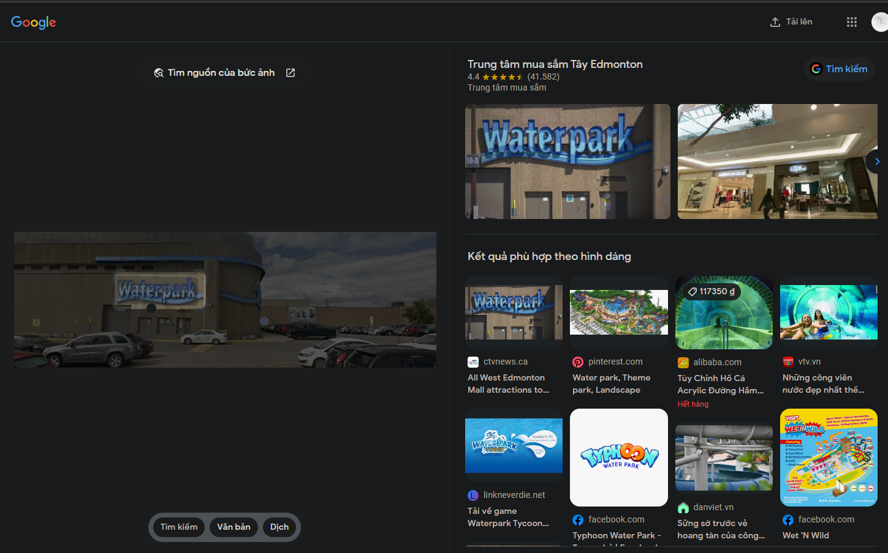
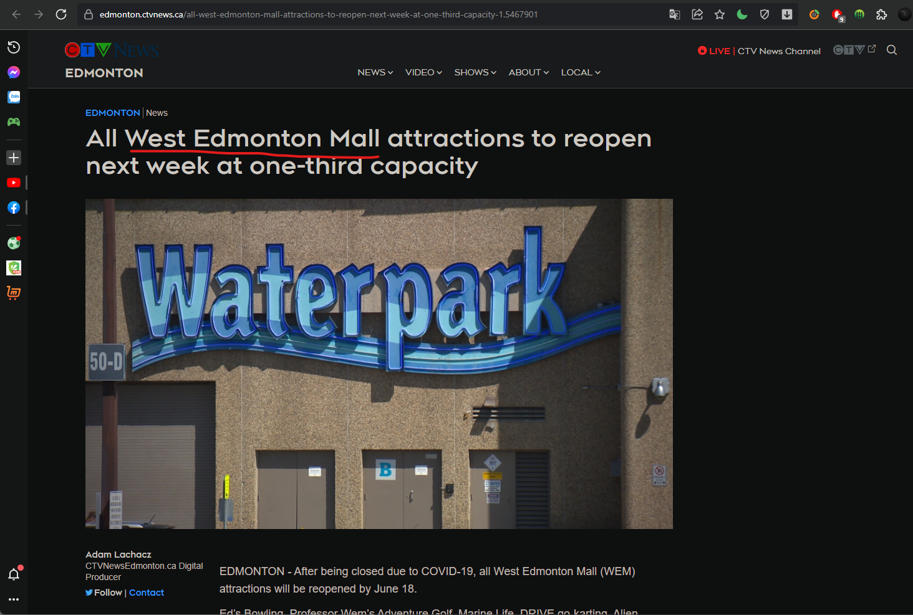

# geo-guess

- Ở bài này sẽ có 1 file ảnh về 1 địa điểm

- Sử dụng google lens để tìm kiếm thông tin

- Và chúng ta dễ dàng biết được địa điểm là `West Edmonton Mall`

- Flag format: jctf{name-of-building}

# Flag: jctf{west-edmonton-mall}