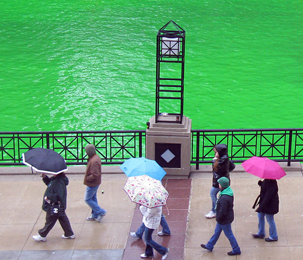
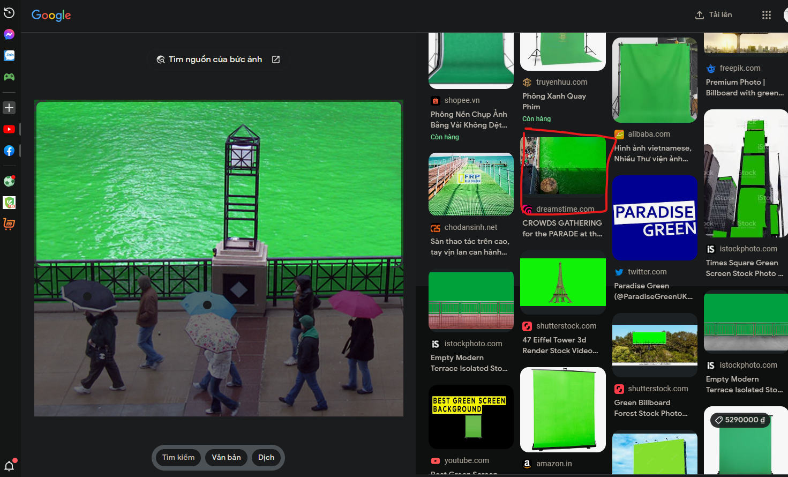
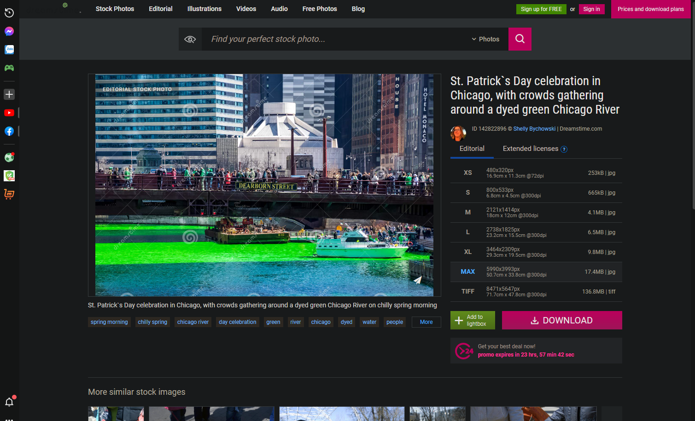
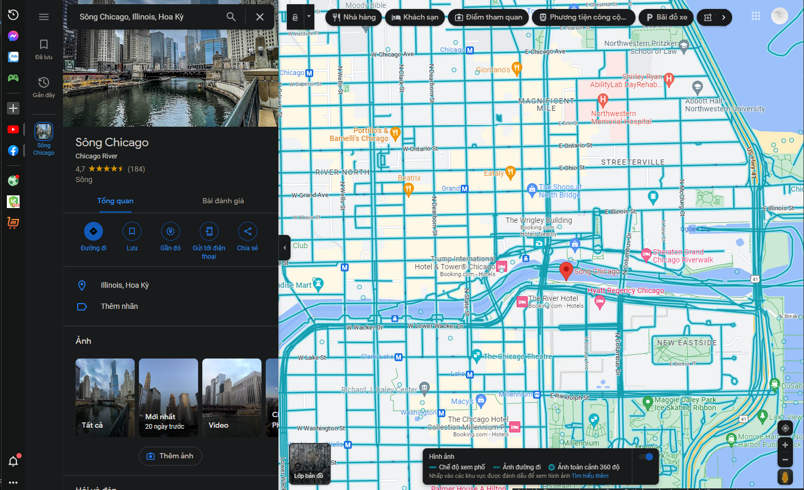
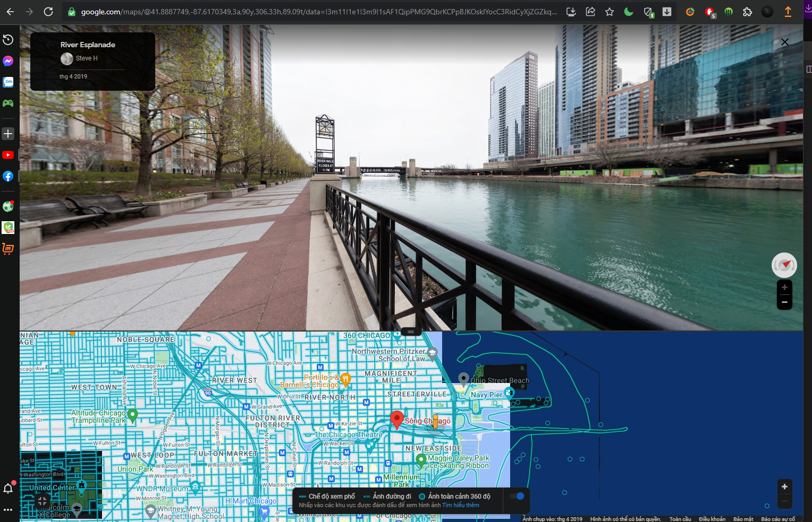
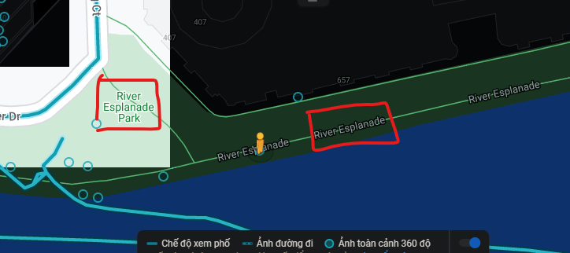

# missing-employee-2

- Ở bài này sẽ cho chúng ta 1 file ảnh

- Ở đây ta sẽ dùng google lens để tìm kiếm địa điểm có bức ảnh 

- Mình tìm thấy 1 bức ảnh có dòng sông màu xanh lục giống bức ảnh 

- Vậy là ta đã xác định địa điểm đó là `Chicago River`

- Sử dụng google maps

- Chuyển qua chế độ xem phố, kiếm hồi lâu mình đã kiếm được nơi giống trong ảnh

- Địa điểm anh ta đang đứng có 2 khả năng và mình đã thử

# Flag: jctf{river-esplanade-park}