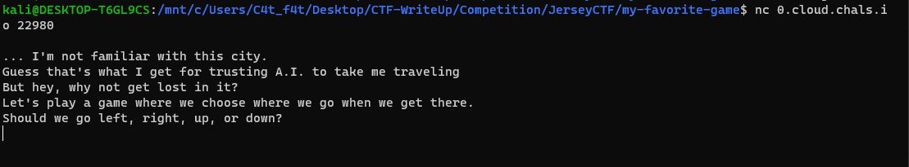
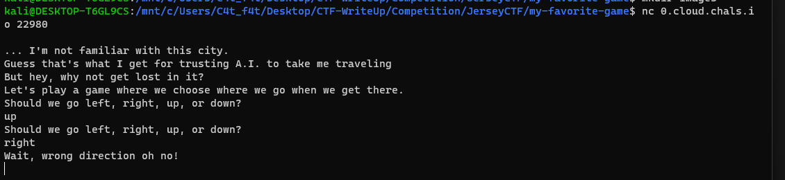
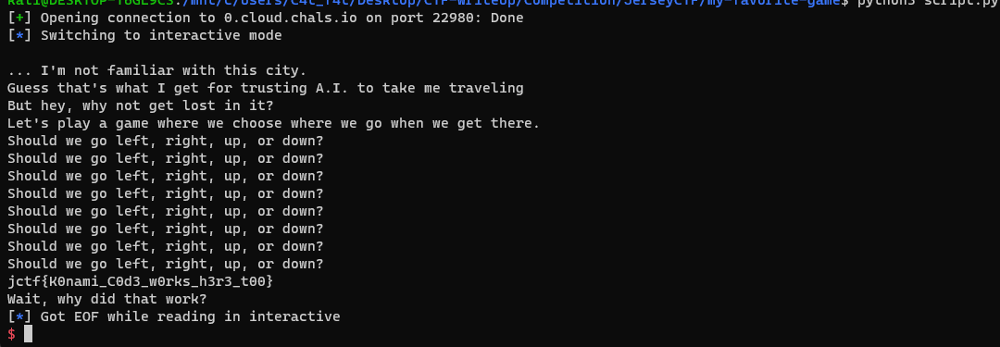

# my-favorite-game

- Ở bài này sẽ cho chúng ta 1 sever netcat và chúng ta có 4 options để lựa chọn 



- Nếu chúng ta lựa chọn đúng option thì chúng ta được nhập tiếp còn sai thì sẽ in ra thông báo sai



- Vậy ta hiểu luồng chương trình là nhập theo đúng lần lượt option và nhận lag cuối

- Ở đây mình sẽ brute-force và có flag



```
from pwn import *

p = remote("0.cloud.chals.io", 22980)
p.sendline(b"up")
p.sendline(b"up")
p.sendline(b"down")
p.sendline(b"down")
p.sendline(b"left")
p.sendline(b"right")
p.sendline(b"left")
p.sendline(b"right")
p.interactive()

```

# Flag: jctf{K0nami_C0d3_w0rks_h3r3_t00}