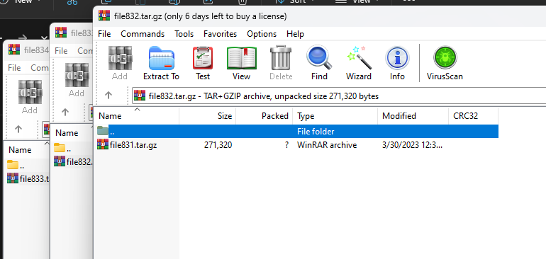
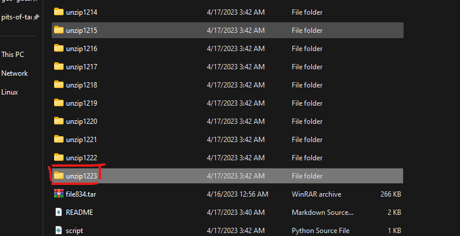

# pits-of-tartarus

- Ở bài này sẽ có 1 file zip mà trong đó lại có nhiều file zip con



- Ta sẽ viết 1 tool bằng python để giải nén hết tất cả file

```
import tarfile
import os

patch = "path/to/that/folder/have/zip/file"
folder = ''
count = 0

while True:
    pathnew = os.path.join(patch, folder)
    for tar_file in os.listdir(pathnew):
        if tar_file != 'unzip.py':
            try:
                if tar_file.endswith('.tar.gz'):
                    print('Extracting file:', tar_file)
                    with tarfile.open(os.path.join(pathnew, tar_file), 'r:gz') as archive:
                        folder = 'unzip' + str(count)
                        archive.extractall(folder)
                    count += 1
                else:
                    print(f'Skipping file: {tar_file} is not a gzip-compressed tarball')
            except tarfile.TarError:
                print(f'Error: {tar_file} is not a valid tar file')
                raise
            except FileNotFoundError:
                print(f'Error: {tar_file} not found')
                raise

```

- Sau khi unzip hết tất cả ta có 1 folder cuối cùng và trong đó có flag file



# Flag: jctf{N0t_$tuck_in_tHe_t@r}