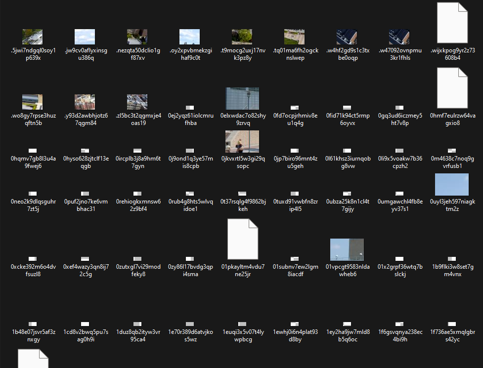
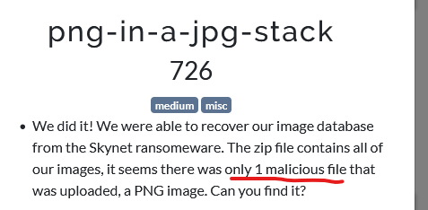
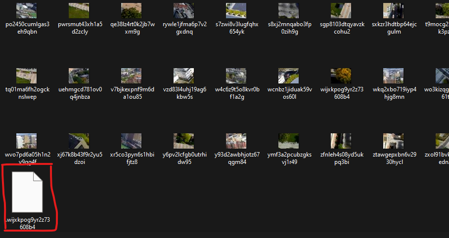
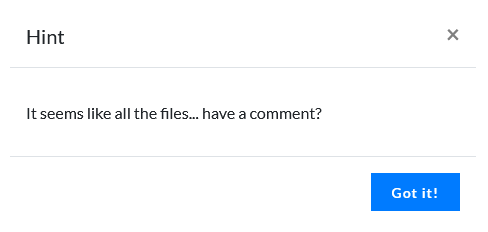
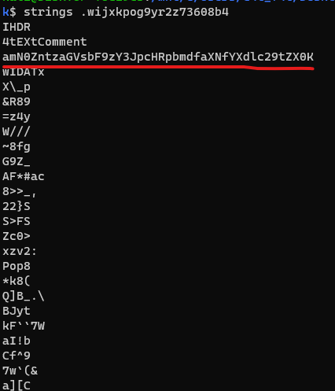

# png-in-a-jpg-stack 

- Ở bài này sẽ cho chúng ta 1 file gồm nhiều ảnh

- Ngay phần đầu bài chúng ta nhận được 1 hint đó là có 1 file đặc biệt

- Mình đã sort by type và đã phát hiện file đặc biệt đó ở cuối

- Kế đến có hint thứ 2 đó là mỗi file đều có 1 comment

- Mình check stings file bằng command `file`

- Sử dụng base64 decode và nhận được flag 

# Flag: jctf{shell_scripting_is_awesome}