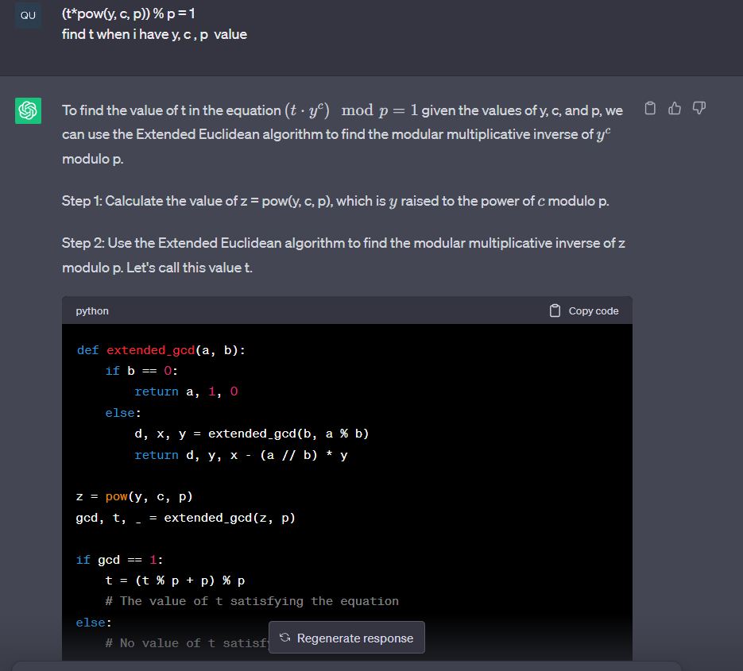
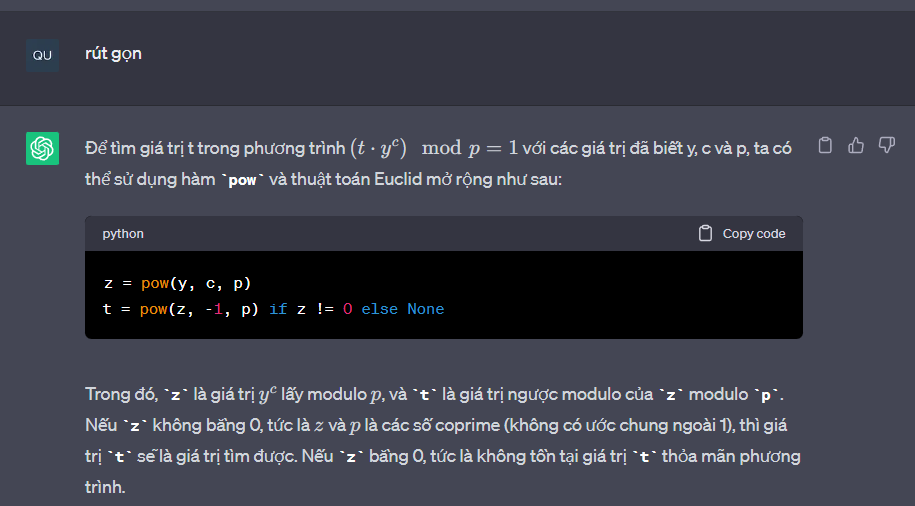
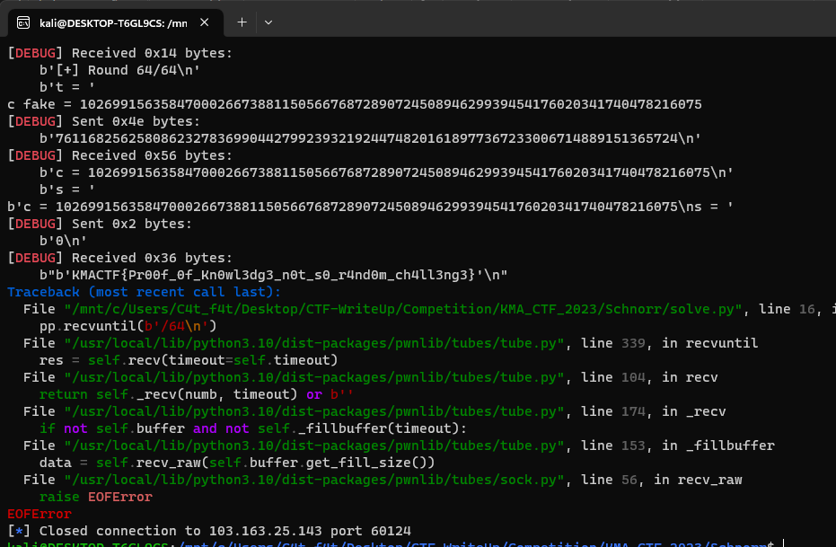

# Crypto - Schnorr

# 1. Phân tích:

Ở bài này, ta có hàm `def challenge(rounds=64):` với vòng lặp 64 lần tương ứng với 64 lần giải thành công ta sẽ có được flag

Ngay đầu hàm `challenge()`, `random.seed(int(time.time()))` được sử dụng để thiết lập giá trị khởi tạo (seed) cho bộ sinh số ngẫu nhiên trong module `random`

Mà `time.time()` sẽ trả về thời gian hiện tại tính theo số giây kể từ ngày 1/1/1970 00:00:00 UTC

Do `c = random.randint(1, q-1)` mà các giá trị `p, g, q, y` luôn không đổi

-> Ta sẽ lấy được giá trị c giống với sever khi chạy `random` trên chính local

Ở đây, chương trình sẽ cho ta nhập vào 2 biến `t` và `s` sau đó sẽ so sánh `pow(g, s, p)` với `(t*pow(y, c, p)) % p`

`pow(g, s, p)` trong Python được sử dụng để tính toán giá trị của biểu thức `g^s mod p`

# 2. Khai thác:

Đầu tiên ta sẽ thiết lập 1 giá trị khởi tạo

```
s=int(time.time())+3
random.seed(s)
```

Do khi mình chạy seed trên local và đến khi chạy sever khác nhau nên seed sẽ có chênh lệch, mình đã test và lấy `time.time() + 3`

Ở hàm `pow(g, s, p)`, do ta có thể điều chỉnh giá trị mũ `s` 

-> Mình nhập vào `s = 0` và khiến giá trị này luôn bằng `1` khi chia dư cho `p`

Việc còn lại là tìm t trong `(t*pow(y, c, p)) % p = 1` khi đã có `y , c, p`

Mình đã sử dụng `chat_GPT` để làm phần này





# 3. Cat flag

Chạy script với chế độ `DEBUG` do mình chạy với chế độ thường thì đã bị hàm `recvuntil()` nhận hết nên k in ra flag



```
Flag: KMACTF{Pr00f_0f_Kn0wl3dg3_n0t_s0_r4nd0m_ch4ll3ng3}
```


