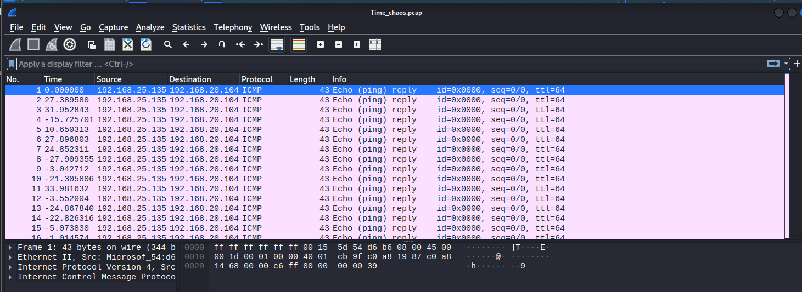
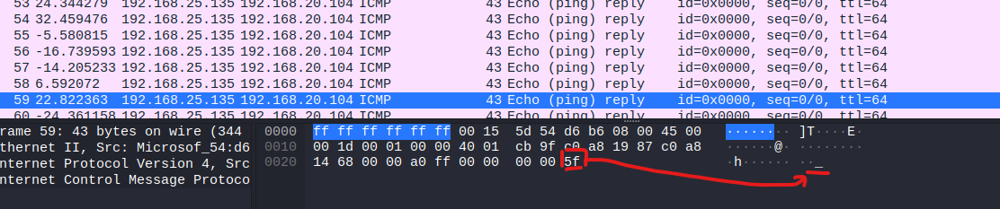
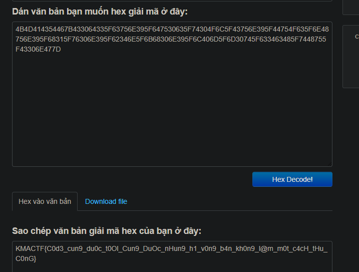

# Forensic - Time_chaos

# 1. Phân tích:

Đây là file `.pcap` (Packet Capture) là một định dạng tệp được sử dụng để lưu trữ dữ liệu gói tin mạng đã được bắt trong quá trình phân tích lưu lượng mạng

Ta sử dụng `wireshark` để phân tích tệp

Sau khi lướt qua các `Frame` 1 lượt thì mình phát hiện ra ký tự cuối chính là các ký tự của flag

Tiếp đến, đề bài chính là `Time_chaos` nên mình đã sort by time và các ký tự của flag đã được đặt đúng trình tự

# 2. Cat flag

Mình đã sử dụng cách thủ công lấy từng ký tự cuối và sử dụng hex decode và nhận được flag

