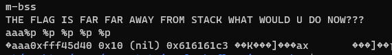
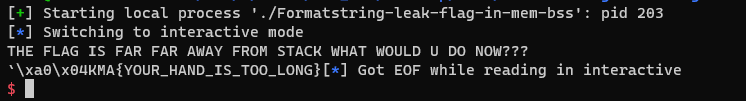

# Formatstring-leak-flag-in-mem-bss

# 1. Xem thông tin file

Ta sẽ dùng lệnh `file` để xem thông tin file challenge:
```
Formatstring-leak-flag-in-mem-bss: ELF 32-bit LSB executable, Intel 80386, version 1 (SYSV), dynamically linked, interpreter /lib/ld-linux.so.2, for GNU/Linux 2.6.32, BuildID[sha1]=e3f0c3e8d930bca253052bed360fee4a72791750, not stripped
```
Đây là file 32-bit không bị ẩn tên hàm.

Tiếp đến ta sẽ sử dụng ida-pro-32bit

Ở đây có 2 hàm ta cần quan tâm đến do ở main gọi luôn đến hàm này:


# 2. Ý tưởng

Có thể thấy ngay tại hàm `main()`, chương trình đã đọc file flag và lưu vào địa chỉ biến `secret` sau đó gọi đến hàm `vun()`

```
stream = fopen("flag", "r");
__isoc99_fscanf(stream, "%s", &secret);
fclose(stream);
vun();
```

Tại hàm `vun()`, có thể phát hiện ngay ra lỗi `format string`

```
return printf(buf);
```

Về lỗi `format string`:
```
Lỗi format stringlà một lỗi bảo mật trong việc sử dụng các chuỗi định dạng trong ngôn ngữ lập trình, như C. Lỗi này xảy ra khi không kiểm soát đủ việc xử lý các chuỗi định dạng người dùng nhập vào hoặc lấy từ bên ngoài, dẫn đến việc tấn công bằng cách truyền các chuỗi định dạng độc hại
```

Do flag được lưu vào địa chỉ biến `secret` = `0x0804A060` mà địa chỉ đó không đổi khi chạy chương trình


-> Lợi dụng lỗi `format string` để đọc giá trị tại địa chỉ biến `secret`

# 3. Khai thác

Để đọc được giá trị tại địa chỉ nào đó, ta sẽ sử dụng `%<k>s` để đọc giá trị tại địa chỉ tại vị trí thứ `k` trên stack

-> Ta sẽ làm xuất hiện địa chỉ của `secret` trên stack bằng cách nhập vào biến `s` vì biến `s` dược lưu ở trên stack

Kế đên, tìm vị trí của địa chỉ ấy trên stack. Ở đây mình sử dụng `%p` để in ra giá trị của các vị trí trên stack dưới dạng hex



OK vậy là đã biết biến `s` được lưu trữ tại vị trí thứ 4 trên stack

Vậy ta sẽ đặt địa chỉ biến `secret` lên đầu biến `s` (chính là vị trí thứ 4 trên stack) và sử dụng `%4$s` để đọc giá trị tại địa chỉ thứ 4 trên stack dưới dạng string 

Mã khai thác: 

```
payload = p32(0x804A060) + b'%4$s'
```

Chạy mã khai thác và nhận được flag:

