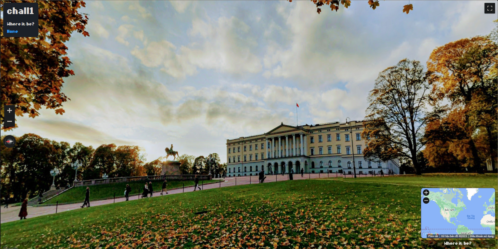
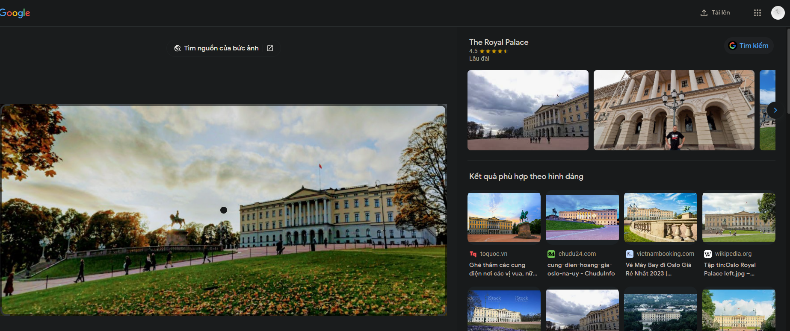

# Gone Missing 1

- Ở đây ta được cung cấp 1 hình ảnh và phải tìm địa chỉ của nó



- Mình sử dụng `google lens` để tìm kiếm thông tin bức ảnh



- Sau khi tìm kiếm từ khóa `Oslo Royal Palace`, mình đã tìm được địa điểm của bức ảnh 

```
https://www.google.com/maps/@59.9170629,10.7298181,3a,90y,259.21h,96.18t/data=!3m11!1e1!3m9!1sAF1QipOUkl6k12cD3_wuXunz2vO6ZTdJIhQPrFllGUWV!2e10!3e11!6shttps:%2F%2Flh5.googleusercontent.com%2Fp%2FAF1QipOUkl6k12cD3_wuXunz2vO6ZTdJIhQPrFllGUWV%3Dw203-h100-k-no-pi-0-ya42.86952-ro-0-fo100!7i7744!8i3872!9m2!1b1!2i30?hl=vi-VN
```

- Chọn địa điểm ấy trên bản đồ của challenge và lấy flag thôi
