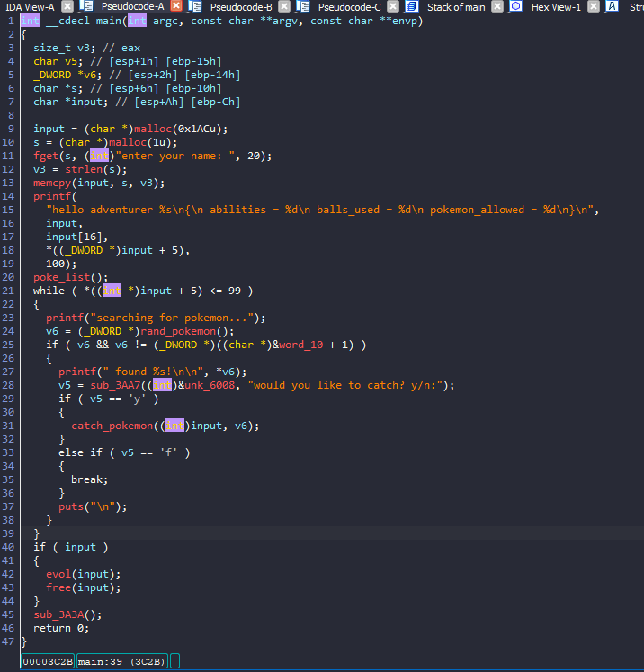
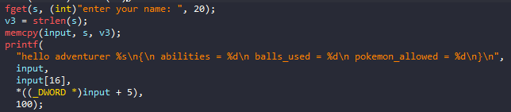
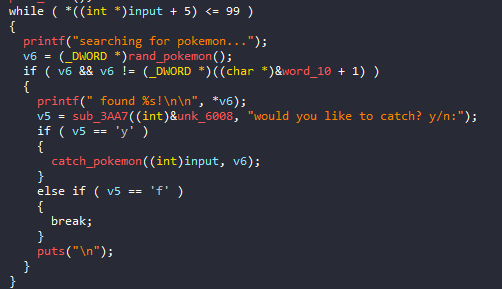
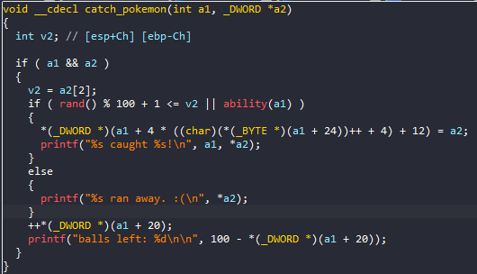
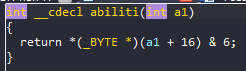
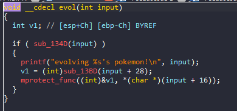
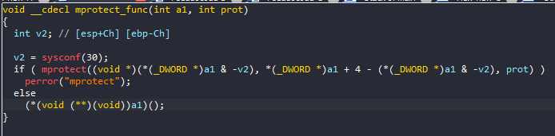
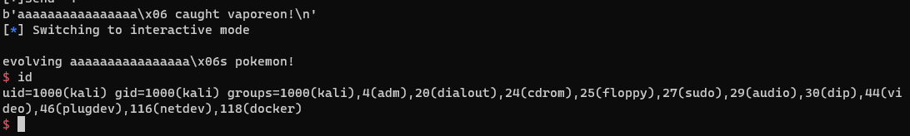

# UMDCTF_2023 - Catch_them_all

# 1. Xem thông tin file

Ta sẽ dùng lệnh `file` để xem thông tin file challenge:
```
catch_them_all: ELF 32-bit LSB pie executable, Intel 80386, version 1 (SYSV), dynamically linked, interpreter /lib/ld-linux.so.2, BuildID[sha1]=0f6385b19833198009579c3d52eb19d1b4f9ff2d, for GNU/Linux 3.2.0, stripped
```
Đây là file 32-bit bị ẩn tên hàm. Kế đến, ta sẽ kiểm tra security của file:
```
Arch:     i386-32-little
RELRO:    Full RELRO
Stack:    No canary found
NX:       NX disabled
PIE:      PIE enabled
RWX:      Has RWX segments
```

Hiếm khi chế độ NX được bật ở các challenges nên mình nghĩ bài này sẽ sử dụng shellcode

Tiếp đến đưa file vào ida-32bit



# 2. Phân tích & khai thác



- Ban đầu chương trình cho ta nhập 20 ký tự vào vị trí con trỏ `s` và lưu vào vị trí con trỏ `input`

16 ký tự đầu sẽ là `adventurer's name` 

Ký tự ở ví trí thứ 17 sẽ là `abilities`: đây là khả năng bắt pokemon của `adventurer`, mình sẽ nói kỹ hơn ở phần sau


- Kế đến ta có 1 danh sách các pokemon có số hiệu từ `1->255`



- Oke tiếp theo đó là chương trình sẽ in ra ngẫu nhiên 1 pokemon và ta có 3 quyết định đó là:

`y`: yes
`n`: no
`f`: f*ck

Nếu sử dụng quyền `f`, ta sẽ break vòng lặp 100 quả bóng pokemon và tiến vào phần tiếp theo luôn

Quyền `n` để bỏ qua và lặp lại với random 1 pokemon khác

Quyền `y` để ta bắt pokemon, vào hàm bắt pokemon



- Ở đây nếu `random%100 + 1 <= v2[2]` hoặc `ability()` đúng



- Ở đây là vị trí thứ 16 cũng là `abilities` lúc đầu mình nói & với 6, nếu đúng sẽ cho ta bắt pokemon, không thì pokemon chạy mất

Vậy payload đầu tiên của mình sẽ khiến `abilities` = `0x6`

```
p.sendline(b"a"*16 + p32(6))  #send name and make abilities = 0x6
```

Khi bắt được pokemon 

```
*(_DWORD *)(a1 + 4 * ((char)(*(_BYTE *)(a1 + 24))++ + 4) + 12) = a2;
```

Đoạn code trên có chức năng gán giá trị của phần tử thứ 3 của mảng a2 vào một ô nhớ cụ thể trong bộ nhớ, tại địa chỉ được tính toán bằng biến đếm được lưu trữ tại địa chỉ `a1 + 24`

Sau đó, biến đếm này được tăng lên một đơn vị để địa chỉ của ô nhớ sẽ khác trong lần ghi tiếp theo. Đây là nơi mình sẽ lưu trữ từng bytes của shellcode theo các pokemon bắt được

Với `a2` là giá trị random tại pokemon_list với phần thử thứ 3 là giá trị số tương ứng của nó.

- Kế đến ta sẽ đến hàm `evol()`



```
int __cdecl sub_134D(int a1)
{
  return *(_BYTE *)(a1 + 16) & 7;
}
```

Ở đây hàm `sub_134D()` nếu trả về đúng thì sẽ thực thi các câu lệnh trong hàm if của hàm `evol()`

Ok vì 7 có 4 bytes cuối trong hệ nhị phân là `0111` => với `*(_BYTE *)(a1 + 16)` ban đầu ta nhập vào là `0x6` với 4 bytes cuối trong

hệ nhị phân là `0110` thì với phép `and` sẽ trả về giá trị `0110` thỏa mãn

- Các câu lệnh trong vòng lặp if

`v1 = (int)sub_13BD(input + 28);`

với `sub_13BD()`

```
_BYTE *__cdecl sub_13BD(int input_28)
{
  _BYTE *v2; // [esp+8h] [ebp-10h]
  int i; // [esp+Ch] [ebp-Ch]

  v2 = calloc(0x64u, 1u);
  for ( i = 0; i <= 99 && *(_DWORD *)(4 * i + input_28); ++i )
    v2[i] = *(_BYTE *)(*(_DWORD *)(4 * i + input_28) + 4);
  return v2;
}
```

Ta có thể hiểu đơn giản rằng đây là một hàm trả về một địa chỉ bộ nhớ được cấp phát động và biến `v1` sẽ lưu trữ địa chỉ này

- Tiếp theo là `mprotect_func()`



Hàm này có các tham số truyền vào là `a1`, prot. Đầu tiên, nó khai báo biến v2 và gán giá trị trả về của hàm sysconf(30) (kích thước trang) vào biến này.

Sau đó, hàm sử dụng mprotect để cấp quyền truy cập cho phần của bộ nhớ bắt đầu từ địa chỉ *(_DWORD *)a1 và có kích thước là *(_DWORD *)a1 + 4 - (*(_DWORD *)a1 & -v2) (trừ đi độ dài phần chưa được trang bị bảo vệ tính toán từ phần bắt đầu đến địa chỉ được chia hết cho v2, để trang bị bảo vệ cho toàn bộ trang). Nếu hàm mprotect trả về giá trị khác 0, nghĩa là thất bại, hàm sẽ ghi thông báo lỗi tương ứng với giá trị lỗi được trả về bằng hàm perror.

Nếu hàm mprotect thành công, thì hàm sẽ gọi hàm tại địa chỉ a1 thông qua con trỏ hàm, bằng cách ép kiểu con trỏ a1 thành một con trỏ tới một con trỏ hàm và sau đó giải tham chiếu để gọi hàm đó.

# 3. Luồng khai thác:

- Mình sẽ lưu từng bytes shellcode thành chuỗi theo các pokemon bắt được tại địa chỉ `input + 24` và sau đó lưu địa chỉ của chuỗi này vào biến `v1` trước khi gọi hàm `mprotect_func()`

Sau khi gọi hàm `mprotect_func()` thì hàm này sẽ gọi địa chỉ `v1`. Ở đây chứa địa chỉ của shellcode và thực thi nó

- Để bắt pokemon thì mình đã list tất cả pokemon ra và khi nào trúng pokemon ấy theo thứ tự và giống với shellcode thì mình sẽ bắt

Sau khi mình đã đặt `abilities` thành `0x6` thì chắc chắn pokemon nào mình bắt cũng sẽ thành công

Nếu không phải pokemon mình cần bắt thì mình sẽ dùng `n` để bỏ qua và random lại, vì mình có tận 100 bóng pokemon cơ nên shellcode độ dài thoải mái ^^

Nếu shellcode không đến 100 bytes thì mình sẽ dùng `f` để dừng bắt

- 1 điều quan trọng nữa là trên sever đã tắt stdout nên mình có lấy shell thì cũng không hiện gì ra cho mình, mình đã nghĩ 1 hướng đó là viết shellcode sử dụng `sys_open`, `sys_read` và `sys_write` để in flag nhưng mình đã được hint sử dụng lệnh `python3 script.py DEBUG` và nhận được flag


 


