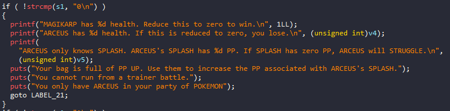
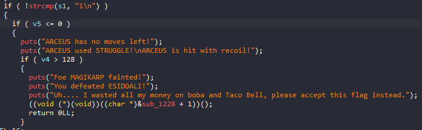
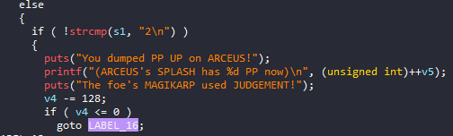
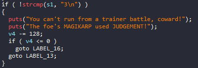
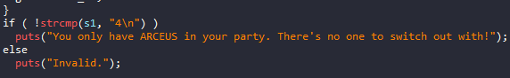
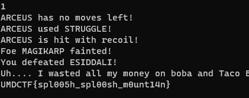

# UMDCTF_2023 - Splash

# 1. Xem thông tin file

Ta sẽ dùng lệnh `file` để xem thông tin file challenge:
```
splash: ELF 64-bit LSB pie executable, x86-64, version 1 (SYSV), dynamically linked, interpreter /lib64/ld-linux-x86-64.so.2, BuildID[sha1]=2353b25277a8c7365120419de448914ed141f3ee, for GNU/Linux 3.2.0, stripped
```
Đây là file 64-bit bị ẩn tên hàm. Kế đến, ta sẽ kiểm tra security của file:
```
Arch:     amd64-64-little
RELRO:    Full RELRO
Stack:    Canary found
NX:       NX enabled
PIE:      PIE enabled
```

Tiếp đến đưa file vào ida-64bit

```
__int64 __fastcall main(int a1, char **a2, char **a3)
{
  int v4; // [rsp+4h] [rbp-41Ch]
  int v5; // [rsp+8h] [rbp-418h]
  char s1[8]; // [rsp+10h] [rbp-410h] BYREF
  __int64 v7; // [rsp+18h] [rbp-408h]
  char v8[1009]; // [rsp+20h] [rbp-400h] BYREF
  unsigned __int64 v9; // [rsp+418h] [rbp-8h]

  v9 = __readfsqword(0x28u);
  *(_QWORD *)s1 = 0LL;
  v7 = 0LL;
  memset(v8, 0, sizeof(v8));
  v4 = 514;
  v5 = 0x7FFFFFFE;
  setvbuf(stdout, 0LL, 2, 0LL);
  puts("You are challenged by ESIDDALI!");
  puts("ESIDDALI sent out MAGIKARP!");
  puts("Go! ARCEUS!");
  puts("What will you do? (Enter a number)");
  puts("0. CHECK BATTLE STATUS");
  puts("1. FIGHT");
  puts("2. BAG");
  puts("3. RUN");
  puts("4. POKEMON");
  putchar(10);
  while ( fgets(s1, 0x401, stdin) )
  {
    if ( !strcmp(s1, "0\n") )
    {
      printf("MAGIKARP has %d health. Reduce this to zero to win.\n", 1LL);
      printf("ARCEUS has %d health. If this is reduced to zero, you lose.\n", (unsigned int)v4);
      printf(
        "ARCEUS only knows SPLASH. ARCEUS's SPLASH has %d PP. If SPLASH has zero PP, ARCEUS will STRUGGLE.\n",
        (unsigned int)v5);
      puts("Your bag is full of PP UP. Use them to increase the PP associated with ARCEUS's SPLASH.");
      puts("You cannot run from a trainer battle.");
      puts("You only have ARCEUS in your party of POKEMON");
      goto LABEL_21;
    }
    if ( !strcmp(s1, "1\n") )
    {
      if ( v5 <= 0 )
      {
        puts("ARCEUS has no moves left!");
        puts("ARCEUS used STRUGGLE!\nARCEUS is hit with recoil!");
        if ( v4 > 128 )
        {
          puts("Foe MAGIKARP fainted!");
          puts("You defeated ESIDDALI!");
          puts("Uh.... I wasted all my money on boba and Taco Bell, please accept this flag instead.");
          ((void (*)(void))((char *)&sub_1228 + 1))();
          return 0LL;
        }
LABEL_16:
        puts("ARCEUS fainted!");
        puts("You have ran out of usable POKEMON!");
        puts("Unlucky!1!");
        return 0LL;
      }
      printf("ARCEUS used SPLASH!\nBut nothing happened!");
      puts("The foe's MAGIKARP used JUDGEMENT!");
      v4 -= 128;
      if ( v4 <= 0 )
        goto LABEL_16;
      --v5;
      printf("(ARCEUS has %d health now)\n", (unsigned int)v4);
      puts("(MAGIKARP's health is unchanged)");
      printf("(ARCEUS's SPLASH has %d PP now)\n", (unsigned int)v5);
    }
    else
    {
      if ( !strcmp(s1, "2\n") )
      {
        puts("You dumped PP UP on ARCEUS!");
        printf("(ARCEUS's SPLASH has %d PP now)\n", (unsigned int)++v5);
        puts("The foe's MAGIKARP used JUDGEMENT!");
        v4 -= 128;
        if ( v4 <= 0 )
          goto LABEL_16;
LABEL_13:
        printf("(ARCEUS has %d health now)\n", (unsigned int)v4);
        puts("(MAGIKARP's health is unchanged)");
        goto LABEL_21;
      }
      if ( !strcmp(s1, "3\n") )
      {
        puts("You can't run from a trainer battle, coward!");
        puts("The foe's MAGIKARP used JUDGEMENT!");
        v4 -= 128;
        if ( v4 <= 0 )
          goto LABEL_16;
        goto LABEL_13;
      }
      if ( !strcmp(s1, "4\n") )
        puts("You only have ARCEUS in your party. There's no one to switch out with!");
      else
        puts("Invalid.");
    }
LABEL_21:
    puts("\nWhat will you do? (Enter a number)");
    puts("0. CHECK BATTLE STATUS");
    puts("1. FIGHT");
    puts("2. BAG");
    puts("3. RUN");
    puts("4. POKEMON");
    putchar(10);
  }
  return 0LL;
}
```
# 2. Phân tích 

Ở đây có 5 options cho ta chọn

- Option 0: 



Nếu ta chọn option này sẽ in ra `ARCEUS` health và `ARCEUS's SPLASH`, không quan tâm ở đây

- Option 1: 



Ở đây nếu `v5 <= 0` và `v4 > 128` thì sẽ in ra flag cho ta, ta sẽ kiếm điều kiện cho nó

- Option 2: 



Ở đây sẽ tăng giá trị `v5` lên 1 và giá trị `v4` sẽ giảm đi `128`

- Option 3:



Ở đây `v4` sẽ giảm đi `128`

- Option 3:



Ở đây chỉ in ra thông báo ngoài màn hình

# 3. Khai thác

Ok ở đấy ban đầu đã gán giá trị `v4` và `v5`

```
v4 = 514;
v5 = 0x7FFFFFFE;
```

Nhìn qua sẽ thấy có `integer overflow` với biến `v5` vì số dương mawxx là `0x7FFFFFFF` 

Ở option 2 sẽ tăng giá trị `v5` lên 1 và giá trị `v4` sẽ giảm đi `128`

Option 1 thì chỉ cần `v5 <= 0` và `v4 > 128` sẽ in ra flag cho ta

=> Dùng option_2 2 lần ta sẽ có đủ điều kiện của option_1 và get flag



