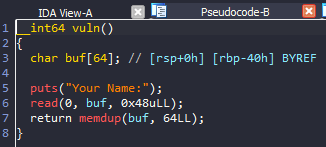
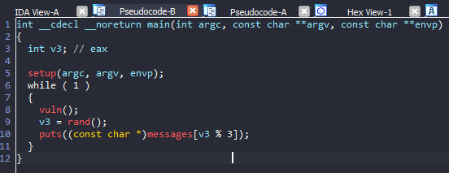
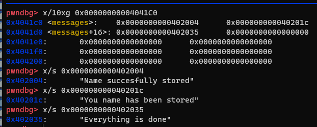
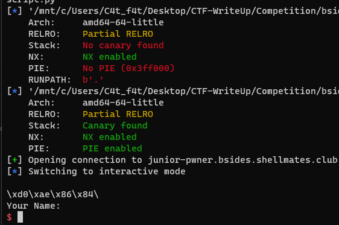
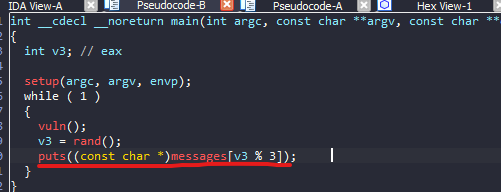
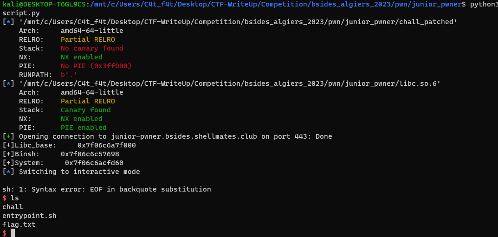

# Bsides_algiers_2023 - Junior_pwner

# 1. Xem thông tin file

Ta sẽ dùng lệnh `file` để xem thông tin file challenge:
```
chall_patched: ELF 64-bit LSB executable, x86-64, version 1 (SYSV), dynamically linked, interpreter ./ld-linux-x86-64.so.2, for GNU/Linux 3.2.0, BuildID[sha1]=24d826dd171e5de121ec5aaa1454d5790ebb04d1, not stripped
```
Đây là file 64-bit không bị ẩn tên hàm. Kế đến, ta sẽ kiểm tra security của file:
```
Arch:     amd64-64-little
RELRO:    Partial RELRO
Stack:    No canary found
NX:       NX enabled
PIE:      No PIE (0x3ff000)
RUNPATH:  b'.'
```

Tiếp đến đưa file vào ida-64bit



# 2. Phân tích 

Ở biến `buf` của hàm `vuln()` có thể thấy ta sẽ overwrite được `rbp`

Sau khi overwrite `rbp` mình đã nhận ra sau khi kết thúc `vuln()` thì 0x40 bytes đầu tiên của biến `buf` sẽ được lưu vào địa chỉ `rbp-0x50`

-> Do bài này chế độ bảo vệ `PIE` đã tắt nên mình sẽ dễ dàng kiểm soát được những nơi mình ghi đè vào
 
# 3. Khai thác

- Bước 1: Leak libc


Sau khi hàm `vuln()` thực thi thì chương trình sẽ random và chọn 1 trong số 3 con trỏ message và in ra màn hình



Oke vậy mình sẽ overwrite ở vị trí này để thay vì in ra vài dòng chữ kia mình sẽ in ra 1 địa chỉ libc nào đó.

Mình quyết định in ra giá trị tại `puts.got@plt` và lấy được libc.



- Bước 2: Overwrite `puts.got@plt` thành `system`

Sau khi leak được libc và tính được địa chỉ chuỗi `/bin/sh` và hàm `system`, mình sẽ ghi đè địa chỉ chuỗi `/bin/sh` vào `message` và overwrite `puts.got@plt` thành `system`

-> Thay vì `puts()` chuỗi thì nó sẽ thực thi chuỗi - ở đây là chuỗi `/bin/sh`



Vậy là lấy được shell

