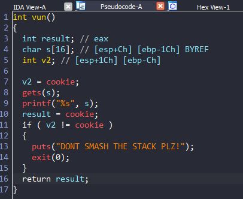
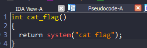
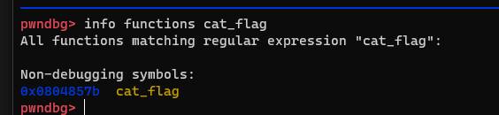
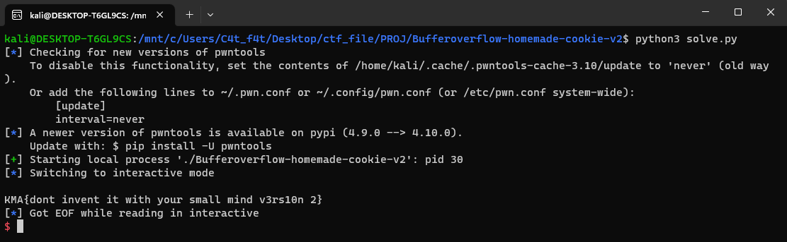

# Bufferoverflow-homemade-cookie-v2

# 1. Xem thông tin file

Ta sẽ dùng lệnh `file` để xem thông tin file challenge:
```
Bufferoverflow-homemade-cookie-v2: ELF 32-bit LSB executable, Intel 80386, version 1 (SYSV), dynamically linked, interpreter /lib/ld-linux.so.2, for GNU/Linux 2.6.32, BuildID[sha1]=a4f7ab5a8c42a3424f02be4c1840f9f8c9f298fb, not stripped
```
Đây là file 32-bit không bị ẩn tên hàm.

Tiếp đến ta sẽ sử dụng ida-pro-32bit

Ở đây có 3 hàm ta cần quan tâm đến:






# 2. Ý tưởng

Tại hàm `main()`, chương trình sẽ tạo random giá trị biến `cookie` và in ra màn hình dưới dạng `hex`

Kế đến hàm `vun()`, ta thấy biến `v2` được gán cho giá trị của biến `cookie` và ta thấy nó sẽ check xem biến `v2` có bị thay đổi sau khi ta nhập vào biến `s` với hàm `gets(s);` hay không

Mà địa chỉ các biến trên stack có thể thấy biến `v2` ngay sau biến `s`: 

```
char s[16]; // [esp+Ch] [ebp-1Ch]
int v2; // [esp+1Ch] [ebp-Ch]
```

-> Lợi dụng lỗ hổng buffer overflow của hàm `gets(s)` để ghi đè đến `return_addr` mà không làm thay đổi giá trị tại `v2` để khi kết thúc, chương trình trả về hàm `cat_flag`
 
# 3. Khai thác

Do ở hàm `main()` đã in ra cho ta giá trị của `cookie` nên ta sẽ sử dụng `python script` để lấy giá trị đó là ghi đè mà không làm thay đổi giá trị `v2`

Đầu tiên, lấy giá trị `v2` bằng câu lệnh: 

```
v2 = int(p.recv(2), 16)     #lấy 2 bytes của biến v2 (được chương trình in ra màn hình) dưới dạng hex và chuyển qua dạng int
```

Tiếp đến lấy địa chỉ của hàm `cat_flag()` để ghi đè `return_addr`



Ok vậy là đủ giá trị cần, tiếp đến ta sẽ tính toán địa chỉ của biến `v2` cũng như `return_addr`

+ 16 bytes đầu ta sẽ sử dụng để ghi đè biến `s` (16 bytes rác bất kỳ)          
+ 4 bytes tiếp theo là giá trị biến `v2`        (Đã lấy được từ trên)
+ 8 bytes sau là khoảng cách từ v2 đến `ebp` 
  4 bytes của `ebp`                             (12 bytes rác bất kỳ)
+ 4 bytes cuối là địa chỉ của `return_addr`     (Ghi đè địa chỉ return_addr bằng địa chỉ hàm cat_flag)

Cuối cùng lợi dụng lỗ hổng buffer overflow của hàm `gets(s)` để ghi đè đến `return_addr`

```
payload = b'a'*16 + p32(v2) + b'a'*12 + p32(cat_flag)
p.sendline(payload)
```

Chạy mã khai thác và lấy được flag



