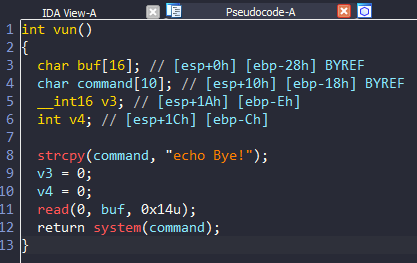
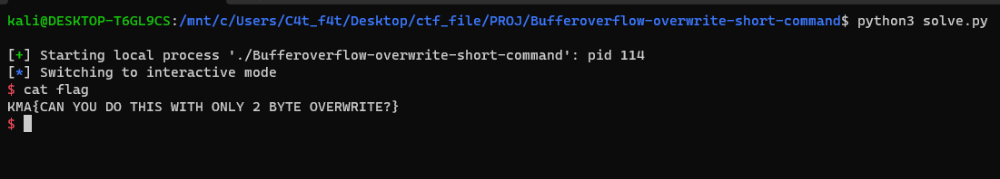

# Bufferoverflow-overwrite-command

# 1. Xem thông tin file

Ta sẽ dùng lệnh `file` để xem thông tin file challenge:
```
Bufferoverflow-overwrite-short-command: ELF 32-bit LSB executable, Intel 80386, version 1 (SYSV), dynamically linked, interpreter /lib/ld-linux.so.2, for GNU/Linux 2.6.32, BuildID[sha1]=e1019ec9190ac9c19f76f3406510e518200b5896, not stripped
```
Đây là file 32-bit không bị ẩn tên hàm.

Tiếp đến ta sẽ sử dụng ida-pro-32bit

Ở đây có 1 hàm ta cần quan tâm đến do ở main gọi luôn đến hàm này:



# 2. Ý tưởng

Đầu tiên, câu lệnh:

```
strcpy(command, "echo Bye!");
```
Dùng để copy chuỗi `echo Bye!` vào biến `command`

Sau đó, chương trình gọi hàm `read(0, buf, 0x14u);` đến gán giá trị cho biến `buf`

Cuối cùng trả về hàm thực thi `system(command);`

Ta thấy, chương trình cho phép đọc vào 20 bytes gán vào biến `buf`

Mà địa chỉ các biến như sau:

```
char buf[16]; // [esp+0h] [ebp-28h]
char command[10]; // [esp+10h] [ebp-18h]
```

Có thể thấy địa chỉ biến `command` nằm ngay sau biến `buf` nên ta có thể lợi dụng lỗi buffer overflow với 4 bytes để ghi đè vào biến `command` để sau khi chương trình return sẽ retrun đến câu lệnh system với `command` như ta muốn

Do ở bài này chỉ có 4 bytes được overflow nên ta sẽ dùng command ngắn như `sh` để lấy shell

# 3. Khai thác

Ok như đã biết, biến `buf` cách `command` 16 bytes nên chuỗi khai thác sẽ là:

+ 16 bytes đầu là địa chỉ biến `buf`
+ 4 bytes còn lại là đị chỉ của `command`

Ở đây mình sẽ ghi đè `command` bằng `sh` để thực thi `system('sh')`

```
Bản thân "/bin/sh" là một đường dẫn tuyệt đối trỏ đến shell được sử dụng như một tiêu chuẩn POSIX trong hầu hết các hệ thống Unix. Trong khi đó, "sh" là một lệnh gọi shell mà hệ thống sẽ tìm kiếm trong các thư mục được liệt kê trong biến môi trường $PATH. Nếu có nhiều phiên bản sh trong các thư mục khác nhau trong $PATH, lệnh "sh" sẽ thực thi phiên bản đầu tiên được tìm thấy trong danh sách $PATH.

Vì vậy, "/bin/sh" là đường dẫn tuyệt đối trỏ trực tiếp đến một shell cụ thể, trong khi "sh" là một lệnh tương đối được gọi để tìm và thực thi shell đầu tiên trong $PATH.
```

Khác biệt chính giữa "/bin/sh" và "sh" nằm ở sự chính xác và đáng tin cậy hơn của "/bin/sh" trong việc xác định shell cụ thể nào sẽ được sử dụng

Mã khai thác ở đây:

```
payload = b'a'*16 + b'sh'
p.sendline(payload)
```

