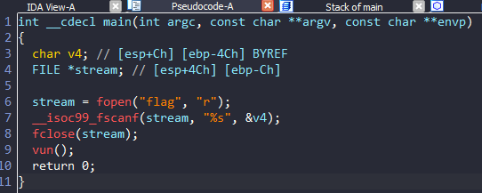
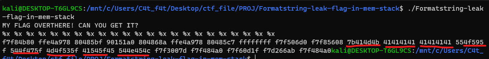

# Formatstring-leak-flag-in-mem-stack

# 1. Xem thông tin file

Ta sẽ dùng lệnh `file` để xem thông tin file challenge:
```
Formatstring-leak-flag-in-mem-stack: ELF 32-bit LSB executable, Intel 80386, version 1 (SYSV), dynamically linked, interpreter /lib/ld-linux.so.2, for GNU/Linux 2.6.32, BuildID[sha1]=ad529cc4162f3b496b79aac6e33340ea55e0677e, not stripped
```
Đây là file 32-bit không bị ẩn tên hàm.

Tiếp đến ta sẽ sử dụng ida-pro-32bit

Ở đây có 2 hàm ta cần quan tâm đến do ở main gọi luôn đến hàm này:




# 2. Ý tưởng

Có thể thấy ngay tại hàm `main()`, chương trình đã đọc file flag và lưu vào địa chỉ biến `v4` sau đó gọi đến hàm `vun()`

Tại hàm `vun()`, có thể phát hiện ra lỗi `format string`

```
return printf(buff);
```

Về lỗi `format string`:
```
Lỗi format stringlà một lỗi bảo mật trong việc sử dụng các chuỗi định dạng trong ngôn ngữ lập trình, như C. Lỗi này xảy ra khi không kiểm soát đủ việc xử lý các chuỗi định dạng người dùng nhập vào hoặc lấy từ bên ngoài, dẫn đến việc tấn công bằng cách truyền các chuỗi định dạng độc hại
```

Một số chuỗi định dạng như:

+ %<k>$n: Đếm số lượng các ký tự đã in ra màn hình trước đó bằng hàm `print()` rồi lưu giá trị đó dưới dạng 32 bit(4 bytes) vào địa chỉ hợp lệ tại vị trí thứ `x` trên stack

+ %<k>$hn: Đếm số lượng các ký tự đã in ra màn hình trước đó bằng hàm `print()` rồi lưu giá trị đó dưới dạng 16 bit(2 bytes) vào địa chỉ hợp lệ tại vị trí thứ `x` trên stack

+ %<k>$hhn: Đếm số lượng các ký tự đã in ra màn hình trước đó bằng hàm `print()` rồi lưu giá trị đó dưới dạng 8 bit(1 bytes) vào địa chỉ hợp lệ tại vị trí thứ `x` trên stack

+ %<k>x: In ra k ký tự ra màn hình

+ %<k>$p: In ra giá trị của stack thứ k dưới dạng hex

....

Do flag được lưu vào địa chỉ biến `v4` mà biến v4 xuất hiện ở trên stack ở vị trí [ebp-0x4c]

```
char v4; // [esp+Ch] [ebp-4Ch]
```

-> Lợi dụng lỗi `format string` để đọc giá trị trên stack

# 3. Khai thác

Bài này chỉ cần sử dụng %x để in ra màn hình giá trị tại các địa chỉ trên stack dưới dạng hex không có `0x` ở đầu



Ở đây mình nhận ra flag khi có các ký tự trong bảng mã ascii là các ký tự có thể in ra màn hình 


Sử dụng trang web `https://www.convertstring.com/vi/EncodeDecode/HexDecode` để chuyển từ hex sang text 

Vì ở cấu trúc 32 bit này sử dụng cấu trúc little edian nên các giá trị sẽ lưu bị ngược 

-> Ta chỉ cần đảo ngược 4 chữ 1, 4 chữ 1 là sẽ có được flag


flag = `KMA{AAAAAAAA_YOU_GOT_SOME_TALENT}`
