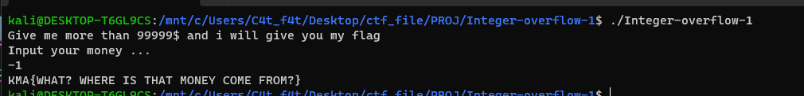

# Integer-overflow-1

Cùng nhìn vào source code của bài này 

```
#include <stdio.h>
#include <stdlib.h>

void vun()
{
    unsigned int temp;
    char buff[4];
    printf("Give me more than 99999$ and i will give you my flag\n");
    printf("Input your money ...\n");
    read(0, buff, 3);
    temp = atoi(buff);
    if (temp > 99999)
        system("cat flag");
    else
        printf("ONLY %d$ ??? YOU CANT GET MY FLAG! BYEEEEEEEEEE!\n", temp);
}

int main()
{
    vun();
    return 0;
}

```

Ở đây, chương trình cấp cho ta 1 biến `buff` và cho ta nhập vào biến `buff` với 3 ký tự rồi sử dụng hàn `atoi()` để biến `buff` thành giá trị int và lưu lại vào biến `temp`

```
read(0, buff, 3);
temp = atoi(buff);
```

Sau đó, chương trình sẽ so sánh biến `temp` và 99999, nếu lớn hơn thì ta sẽ lấy được flag, không thì sẽ in ra thông báo 

```
printf("ONLY %d$ ??? YOU CANT GET MY FLAG! BYEEEEEEEEEE!\n", temp);
```

Làm sao để biến `temp` > 99999 trong khi ta chỉ được nhập vào 3 ký tự?

Do biến `temp` được khai báo dưới dạng `unsigned int`

Ta có int -1 = 0xffffffff và unsigned int MAX = 4294967295 = 0xffffffff.

-> Ta chỉ cần nhập `-1` cho biến `buff` và rồi `atoi()` sẽ biến `-1` tại kiểu dữ liệu int  thành `4294967295` với kiểu dữ liệu `unsigned int` và lưu vào biến `temp` 

Mã khai thác:
 
Nhập `-1` vào biến `buff`'


