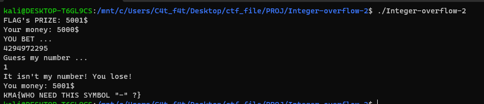

# Integer-overflow-2

Cùng nhìn vào source code của bài này 

```
#include <stdio.h>
#include <stdlib.h>
#include <string.h>

void vun()
{
    char buff[16];
    int your_money = 5000;
    printf("FLAG's PRIZE: 5001$\n");
    printf("Your money: %d$\n", your_money);

    printf("YOU BET ... \n");
    read(0, buff, 15);
    if (strstr(buff, "-") != NULL) // this alway bigger than 0 haha
    {
        printf("BYE BYE HACKER ...\n");
        exit(0);
    }
    int your_bet = strtoul(buff, NULL, 0);

    if (your_bet > your_money)
    {
        printf("YOU THINK I AM STUPID???\n");
        exit(0);
    }

    printf("Guess my number ...\n");
    read(0, buff, 15);

    printf("It isn't my number! You lose!\n");
    your_money -= your_bet;

    printf("You money: %d$\n", your_money);
    if (your_money > 5000)
        system("cat flag");
    else
        printf("Good bye loser\n");
}

int main()
{
    vun();
    return 0;
}

```

Đầu tiên, chương trình khai báo biến `int your_money = 5000` và thông báo rằng `FLAG's PRIZE: 5001$`

Chương trình cho ta 1 biến `buff` và cho đọc vào 15 bytes lưu vào biến `buff`

Kế đến, chương trình chặn đầu vào âm bằng đoạn code sau:

```
if (strstr(buff, "-") != NULL) // this alway bigger than 0 haha
{
    printf("BYE BYE HACKER ...\n");
    exit(0);
}
```

Tiếp theo, chương trình sử dụng đoạn mã 

```
int your_bet = strtoul(buff, NULL, 0);
```

Ở đây chương trình sử dụng hàm `strtoul()` để biến chuỗi buff thành kiểu dữ liệu `unsigned long int` và lưu vào biến `your_bet` với kiểu dữ liệu `int`

Lỗi `integer-overflow` bắt đầu từ đây:

Trong ngôn ngữ C trên cấu trúc 32 bits, kiểu dữ liệu `unsigned long int` có kích thước là 4 byte (32 bit) và miền giá trị của nó là từ 0 đến 4,294,967,295 (2^32 - 1)

Mà miền giá trị của kiểu dữ liệu `int` là từ -2,147,483,648 đến 2,147,483,648

-> Khi ta lưu 1 giá trị > 2,147,483,648 vào biến `your_bet` (Ở đây là kiểu giá trị `int`) thì chương trình sẽ nhảy ngược lại giá trị từ âm trở lên

vd: `2,147,483,649` lưu vào biến `your_bet` thì khi đó biến `your_bet` = `-2,147,483,648`

-> Ta chỉ cần nhập vào giá trị trong khoảng `2,147,483,649` - `4,294,967,295` thì sẽ lưu vào biến `your_bet` và biến nó thành số âm khiến đoạn mã:

```
your_money -= your_bet;
```

Khiến biến `your_money` tăng lên.

# Nhưng nếu biến `your_bet` là 1 số âm quá lớn thì biến `your_money` sẽ vượt quá `2,147,483,648` và lại trở thành số ấm

-> Khoảng giá trị thỏa mãn là `2147483649+5000 = 2147488649` - `4294967295+5000 = 4294972295`


