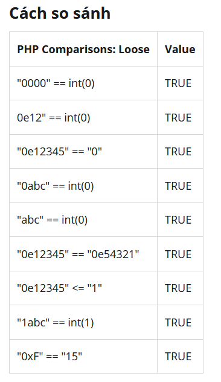

# 1: Bypass login

```
<html>
<form action="verify.php" method="post"> 
    User Name:<br> 
    <input type="text" name="username"><br><br> 
    Password:<br> 
    <input type="password" name="password"><br><br> 
    <input type="submit" name="submit" value="Login"> 
</form>
<!--
if(isset($_POST['submit'])){ 
    $usr = mysql_real_escape_string($_POST['username']); 
    $pas = hash('sha256', mysql_real_escape_string($_POST['password'])); 
    
    if($pas == "0"){ 
        $_SESSION['logged'] = TRUE; 
        header("Location: upload.php"); // Modify to go to the page you would like 
        exit; 
    }else{ 
        header("Location: login_page.php"); 
        exit; 
    } 
}else{    //If the form button wasn't submitted go to the index page, or login page 
    header("Location: login_page.php");     
    exit; 
} 
--> 
</html>
```

Ở đây ta sẽ gửi 1 form gồm username và password. Trong đó chương trình chỉ check đoạn password đã được decode sau khi thực hiện thuật toán sha-256

```
$pas = hash('sha256', mysql_real_escape_string($_POST['password']));
```

Kế đến nó check xem đoạn mã sau khi decode có bằng `0` hay không, nếu đúng, nó sẽ đưa ta đến trang `upload.php`

Do gà nên phải đọc wu!

Ở dòng check: 

```
if($pas == "0")
```

Ta thấy khi so sánh thì chương trình đã sử dụng `==`

Toán tử so sánh `==` nếu như kiểu dữ liệu khác nhau nó sẽ đưa về một kiểu dữ liệu chung để thực hiện việc so sánh



Vậy ta chỉ cần tìm đoạn hash có bắt đầu bằng `0e`

Lên `PayloadAllTheThings` tìm


=> với password = `34250003024812` -> bypass login

# 2: Get shell


Tại đây, ta được phép upload 1 file bất kỳ lên và chương trình sẽ tạo liên kết đến file đó

Mình sẽ upload file shell.php lên và khi trỏ đến đó thì chương trình thực thi webshell. Như shellcode

Webshell lấy tại đây

https://gist.github.com/joswr1ght/22f40787de19d80d110b37fb79ac3985


