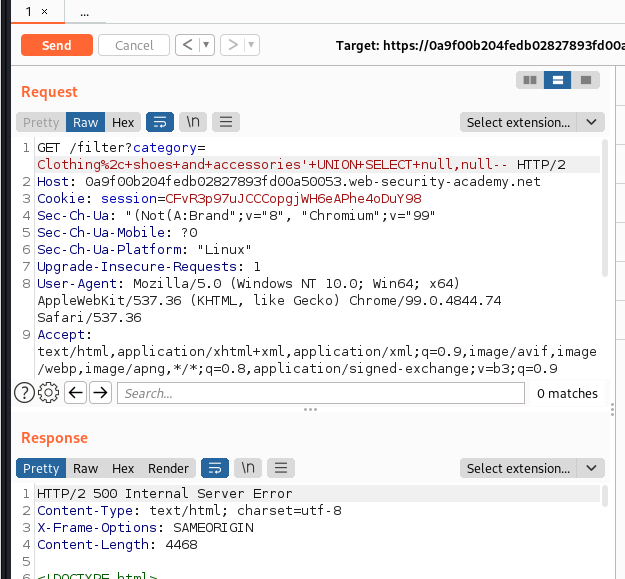

# SQL injection attack, querying the database type and version on MySQL and Microsoft

# 1. Vulnerable

```
This lab contains a SQL injection vulnerability in the product category filter. You can use a UNION attack to retrieve the results from an injected query.

To solve the lab, display the database version string.
```

Lab này yêu cầu ta phải lợi dụng lỗ hổng `SQL injection` trong bộ lọc danh mục sản phẩm và dùng `UNION attack` để hiện ra dãy `database version`

# 2. Exploit

Kiếm tra số cột mà trang web truy vấn vào csdl bằng lệnh `UNION SELECT null...`



Ở đây dù đã test với số lượng null khác nhau nhưng nhận được lỗi nên có lẽ ta đã k filter được `--`

Vào cheat_sheet ta được những data base khác nhau sử dụng các dấu comment khác nhau

```
Oracle	    --comment

Microsoft	--comment
            /*comment*/

PostgreSQL	--comment
            /*comment*/

MySQL	    #comment
            -- comment [Note the space after the double dash]
/*comment*/
```

Mà ở đây sử dụng `MySQL` và `Microsoft` 

Sau khi thử ta có dấu `#` sử dụng được

Sử dụng UNION attack sau khi test được số cột truy vấn là 2

```
'+UNION+SELECT+@@version,null#
```

Ta đã hiện ra được `database version string`


