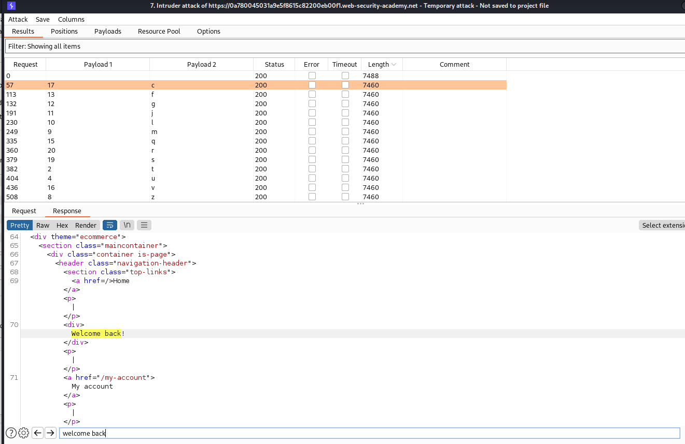

# Blind SQL injection with conditional responses

# 1. Vulnerable

Lab này sử dụng cookie để theo dõi truy vấn

Nếu ta vào lại trang web thì chương trình sẽ hiện ra dòng chữ welcome do cookie của ta đã vào 1 lần rồi


Do ở đây truy các truy vấn sql sẽ không trả về kết quả mà chỉ thực thi nên ta sẽ lợi dụng dòng cữ welcome do cookie để biết tính đúng sai của hàm logic trong phần `SQLi` tại phần cookie

# 2. Exploit

- Ta sẽ thực hiện `SQLi` time delay ở phần cookie để check xem `database` mà trang sử dụng


Như vậy đã xác định được `database` ở đây sử dụng là `PostgreSQL`

- Kế đến sử dụng chuỗi lệnh logic để kiểm tra độ dài của password

Với payload 

```
TrackingId=k4NwIcxPnd65qcro'AND(SELECT+'a'+FROM+users+WHERE+username='administrator'+AND+LENGTH(password)>§1§)='a
```

Ở đây chương trình sẽ kiểm tra xem Id thực hiện chuỗi còn lại xem có đúng không thì chương trình sẽ trả về welcome

Ta sẽ bruteforce độ dài password và nhận được độ dài > 20 là sai và không hiện ra dòng welcome


- Sau khi đã biết độ dài password ta sẽ kiểm tra tiếp đến từng ký tự password. Vì ở đây hint đã cho các ký tự là ký tự thường và số nên số lượng brutefore sẽ ít và có thể làm được

Câu lệnh kiểm tra chuỗi con trên database `PostgreSQL` là `SUBSTRING(password, 4, 2)`

payload

```
TrackingId=k4NwIcxPnd65qcro'AND(SELECT+'a'+FROM+users+WHERE+username='administrator'+AND+SUBSTRING(password, §a§, 1)=§a§)='a
```

Với payload 1 sẽ là từ 1-20 tượng trưng cho ký tự thứ 1-20 của password

payload 2 là các ký tự số và chữ thường


Sau khi bruteforce ta được bảng sau



Khi xuất hiện dòng `welcome back!` thì nghĩa là chữ cái đó đã đúng và ta sẽ ghép password từ 1-20 và solved