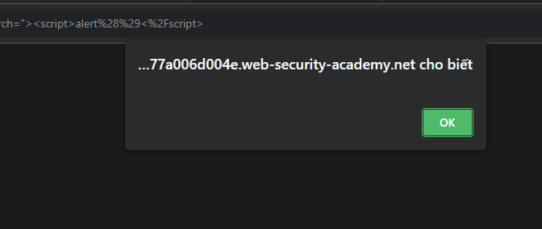

# DOM XSS in document.write sink using source location.search

# 1. Vulnerable

Ở bài này có chứa lỗ hổng `DOM-based XSS`

- DOM (Document Object Model)


`DOM` được hiểu như là một cách để các ngôn ngữ lập trình như JavaScript có thể tương tác và sửa đổi trang web

View-source, ở đây có 1 đoạn mã `JavaScript`

```
<script>
    function trackSearch(query) {
        document.write('');
    }

    var query = (new URLSearchParams(window.location.search)).get('search');

    if(query) {
        trackSearch(query);
    }
</script>
```

Phần này sẽ lấy đoạn ký tự mà ta đã nhập vào ở biến `search` và lưu vào biến `query` trong JS

Tiếp đó, nó sẽ ghi vào trang web nội dung sau ``

# 2. Exploit

Vậy ta sẽ trực tiếp nối chuỗi nhập vào với chuỗi search img html trên trang web

Ta sẽ lợi dụng điều này đóng thẻ img và chèn mã độc vào

Payload: `"><script>alert()</script>`


Đoạn mã của ta đã chèn vào và đóng thẻ HTML và add thêm đoạn mã `alert()`



Sau khi chèn vào thì trang web đã bị cắm mã thành công. Solved