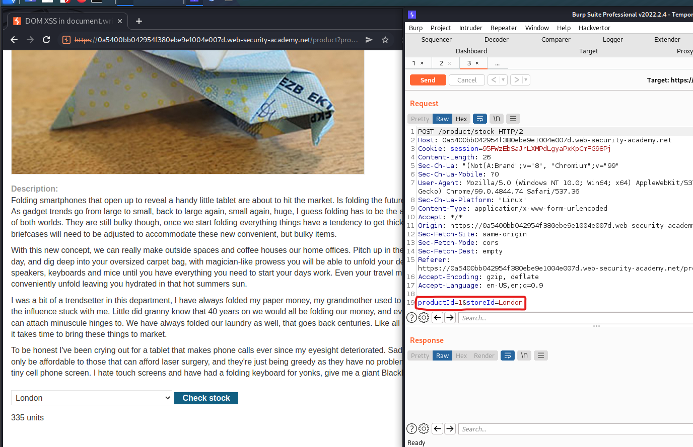

# DOM XSS in document.write sink using source location.search inside a select element

# 1. Vulnerable

View-source:

```
<script>
    var stores = ["London","Paris","Milan"];
    var store = (new URLSearchParams(window.location.search)).get('storeId');
    document.write('<select name="storeId">');
    if(store) {
        document.write('<option selected>'+store+'</option>');
    }
    for(var i=0;i<stores.length;i++) {
        if(stores[i] === store) {
            continue;
        }
        document.write('<option>'+stores[i]+'</option>');
    }
    document.write('</select>');
</script>
```



Đoạn mã script trên sẽ mở thẻ `<select name="storeId">` rồi lấy trên url phần `storeId` và lưu vào biến `store`và sử dụng doc.write để chạy đọan

```
<option selected>'+store+'</option>
```

Vậy `storeId` ta có thể kiểm soát được trên url

# 2. Exploit

Như đã biết thì phần đầu tiên của chương trình đã mở thẻ `select` là thẻ bao các thẻ phía sau nên ta sẽ đóng thẻ `select` rồi mới đến đoạn `script`

Payload

```
/product?productId=1&storeId=</select>
```

