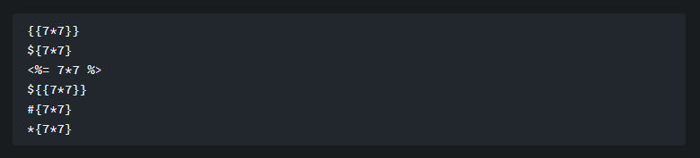
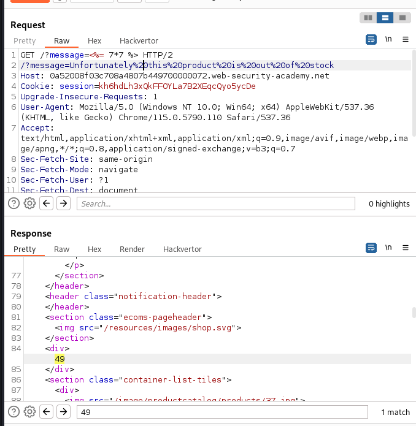
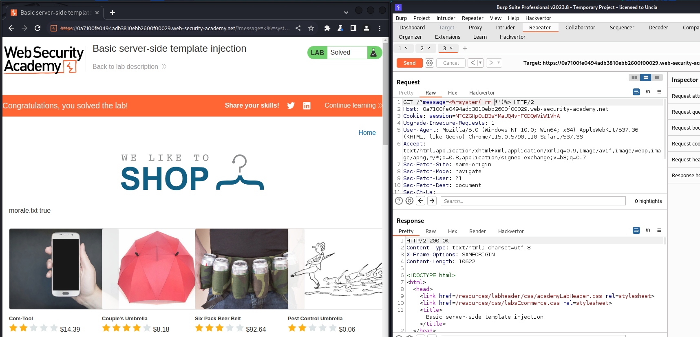

# Lab: Basic server-side template injection

# 1. Vulnerable

Khi vào trang web và nhấp vào sản phẩm đầu tiên ta sẽ có như sau:


Link url lúc đó là: `/?message=Unfortunately this product is out of stock`

Vậy chương trình đã lấy tham số `message` để làm giá trị đầu vào cho 1 hàm nào đó để in ra

-> Dễ dính `ssti`

# 2. Exploit

Khi đã xác định được nơi có thể đã bị `SSTI` thì ta sẽ test payloads phía dưới



Sau khi đã test hết các payload xong thì ta có thể sử dụng 

```
<%= 7*7 %>
```



Kế đến, gọi hàm system và xem địa chỉ của tệp `morale.txt` và xóa thôi

