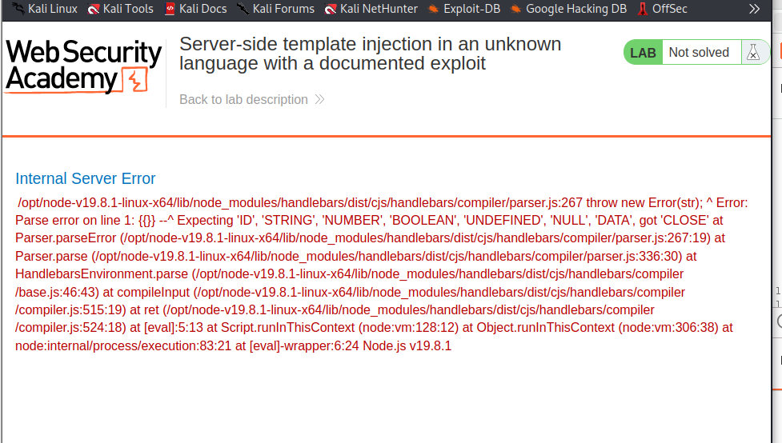
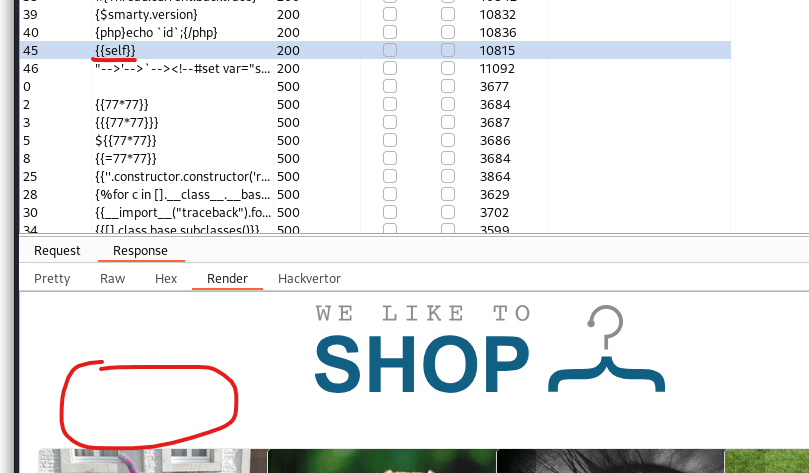
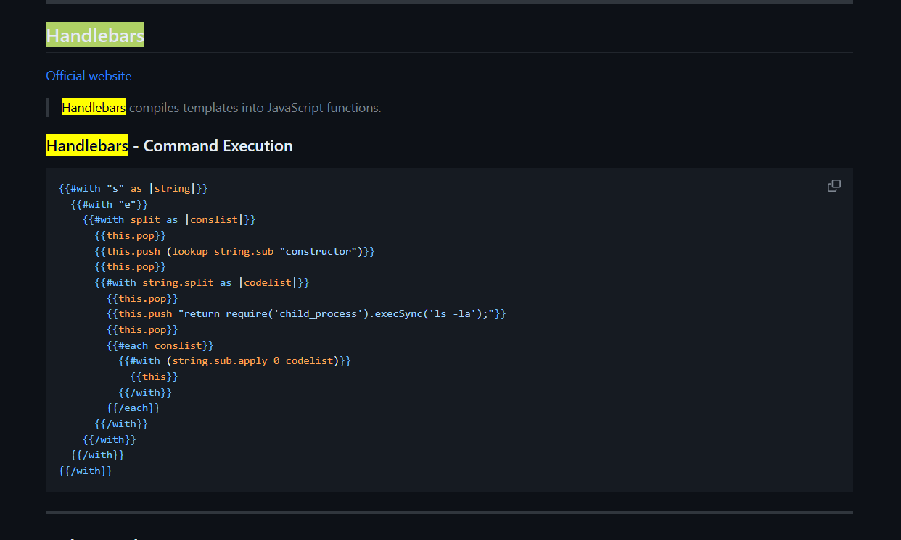
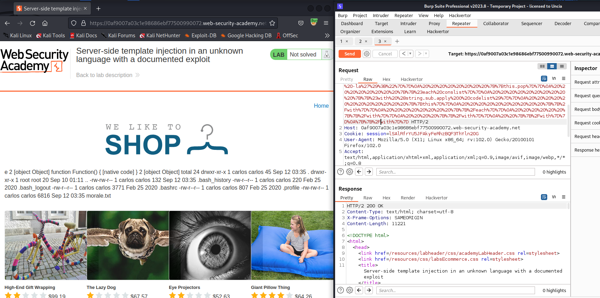

# Lab: Server-side template injection in an unknown language with a documented exploit

# 1. Vulnerable

Khi đầu vào của ta không hợp lệ, trang web sẽ hiển thị nội dung lỗi ra màn hình và ta biết trang web sử dụng `Handlebars`



`Handlebars` là 1 template language nó giúp ta lấy dữ liệu từ dữ liệu đã có và tạo thành 1 trang web động

Ví dụ:

Code `Handlebars`:

```
<h1>{{title}}</h1>
<ul>
  {{#each items}}
    <li>{{this}}</li>
  {{/each}}
</ul>
```

Code `javascript`:

```
const context = {
  title: "Danh sách mục",
  items: ["Mục 1", "Mục 2", "Mục 3"]
};
```

Thì kết quả của biểu thức này sẽ trở thành 1 trang `HTML` như sau:

```
<h1>Danh sách mục</h1>
<ul>
  <li>Mục 1</li>
  <li>Mục 2</li>
  <li>Mục 3</li>
</ul>
```

# 2. Exploit

Do đã biết đây là `handlebars` nên ta thử fuzz `ssti` vào và kết quả trả về như sau



Ta thấy ở đây chỉ duy nhất payload `{{self}}` - tham chiếu đến đối tượng hiện tại và không có output tức là hàm đã thực thi thành công

-> Search với key `handlebars` trên `payloads-all-the-things` ta có 



Ta sẽ `url_encode` và gửi đi



Vậy là ta đã RCE được trang web, việc còn lại là xóa tất cả và solve lab
