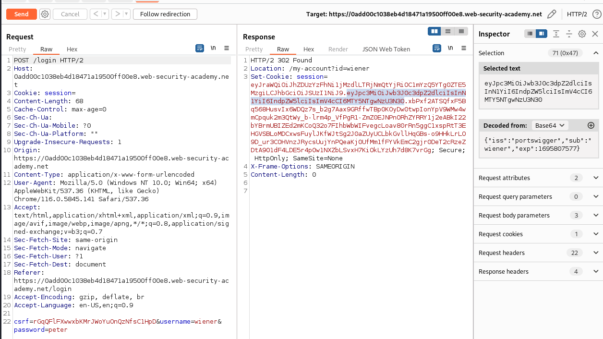

# Lab: JWT authentication bypass via flawed signature verification

# 1. Vulnerable

- Thư viện JWT thường cung cấp một phương thức để xác minh `tokens` và một phương thức khác chỉ giải mã chúng. Ví dụ: thư viện Node.js `jsonwebtoken`có `verify()`và `decode()`. Nhưng dev lại sử dụng `decode()` chỉ để giải mã mà không dùng verify() để xác minh `tokens`

Ở đây có 2 ví dụ

- Dev sử dụng decode() chỉ để giải mã nó

```javascript
const jwt = require('jsonwebtoken');

// Mã token
const secretKey = 'mysecretkey';
const token = jwt.sign({ userId: 123 }, secretKey, { expiresIn: '1h' });

// Giải mã token bằng decode() mà không xác minh
const decodedToken = jwt.decode(token);

console.log(decodedToken); // In ra thông tin giải mã từ token

// Thông tin trong token vẫn có thể truy cập
console.log(decodedToken.userId); // In ra 123
```

- Dev sử dụng verify() để xác minh tokens xem có đúng hay không

```javascript
const jwt = require('jsonwebtoken');

// Mã token
const secretKey = 'mysecretkey';
const token = jwt.sign({ userId: 123 }, secretKey, { expiresIn: '1h' });

// Xác minh và giải mã token
jwt.verify(token, secretKey, (err, decodedToken) => {
  if (err) {
    console.error('Token không hợp lệ!');
  } else {
    console.log(decodedToken); // In ra thông tin giải mã từ token
    console.log(decodedToken.userId); // In ra 123
  }
});
```

# 2. Exploit

Khi ta nhập form đăng nhập thì sẽ được nhận 1 session để đăng nhập vào trang



Thông tin phần header của session gồm có:

```json 
{
    "kid":"ad53c1a6-c37e-4c6d-b4b8-fc49a84e1938",
    "alg":"RS256"
}
```

Phần payload:

```json
{
    "iss":"portswigger",
    "sub":"wiener",
    "exp":1695807577
}
```

Như đã được biết từ trước, dev đã sử dụng hàm `decode()` để đăng nhập vào người dùng trong session thay vì hàm `verify()`

-> Chỉ cần sửa tên người dùng trong session rồi gửi lên sever là ta đã có thể đăng nhập dưới tên người khác rồi


Do trước đó ta sử dụng tài khoản của `wiener` nên việc cần làm là thay đổi session cũ thành session ta vừa sửa

Đăng nhập thành công admin, việc còn lại chỉ cần xóa `carlos` và solve lab 