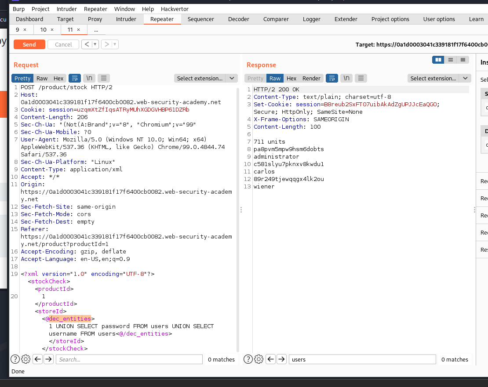

# SQL injection with filter bypass via XML encoding

# 1. Vulnerable

Đây là 1 bài lab vẫn về `SQLi`, ta sẽ sử dụng `UNION ATTACJ` để lấy cắp dữ liệu và đăng nhập bằng tài khoản `administrator`

Ở đây do `web application firewall` (WAF) sẽ chặn tất cả các request có chứa những dấu hiệu của cuộc tấn công `SQLi` nên ta sẽ phải tìm cách mã hóa đoạn code và bypass `WAF`

# 2. Exploit

Ở đây ta thấy rằng khi ta nhấp vào 1 sản phẩm sẽ có phần `produceID` nhưng khi ta SQLi ở đây sẽ nhận được là `Invalid product ID`


Kế đến, khi nhấn vào `Check stock` thí số sản phầm còn lại sẽ hiện ra. 

Ở đây, ta đã yêu cầu phương thức `post` với `produceID` = 1 và `storeID` = 1


Có thể biểu thức SQL khi đó sẽ như sau

```
SELECT produce_number WHERE produceID = 1 AND storeID = 1
```

Mình có thể `SQLi` bằng cách

```
SELECT produce_number WHERE produceID = 1 AND storeID = 1 UNION SELECT null,...
```


Do payload `SQLi` quá lộ nên đã bị chặn

Mình có hint ở đây đó là: sử dụng extension `Hackvertor` từ `burpsuite` và mã hóa đoạn payload của mình


Như vậy ta đã có thể bypass được `WAF` và `SQLi` như bình thường rồi

