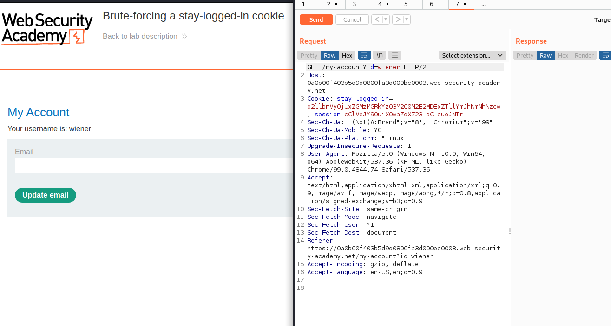

# Lab: Brute-forcing a stay-logged-in cookie

# 1. Vulnerable

Ở lab này sẽ cho ta account cá nhân và `victim's username`

Trang web này có chức năng mới đó là `stay logged in`

Chức năng này sẽ lưu trữ `cookie` của ta lại và lần sau ta sẽ không cần đăng nhập để vào nữa

Ta sẽ lợi dụng cookie này để loggin `victim's account`

# 2. Exploit

Đầu tiên khi đã có 1 list password rồi thì ta cứ `brute-force` đã

Trang web đã chặn đăng nhập nhiều lần dù mình có thử `X-Forwarded-For`

Check lại cookie 1 lần 

Do phần sau wiener: là 32 ký tự (chính là độ dài bắt buộc của 1 bộ hash md5)

-> cookie được tính theo base64 encode của `username:md5(password)`

Bắt đầu `brute-force` cookie

Do đã có format của cookie nên mình sẽ làm như sau: 

md5(password) -> cộng đầu chuỗi với `carlos:` -> base64_encode toàn bộ chuỗi

