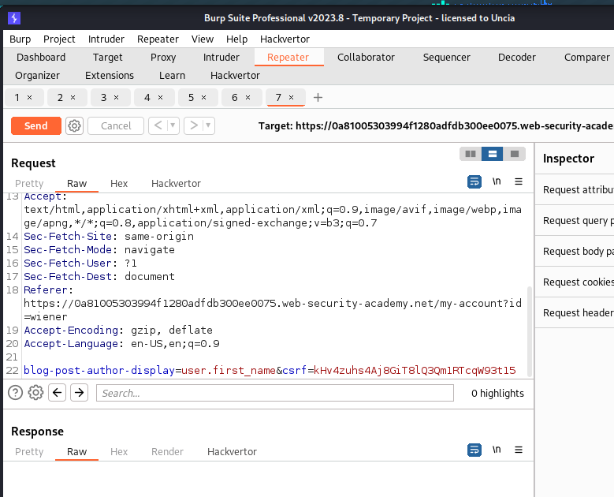

# Lab: Basic server-side template injection (code context)

# 1. Vulnerable

Ở bài lab này ta sẽ được cấp 1 tài khoản và lựa chọn option khi bình luận sẽ hiển thị tên như nào điều này gây ra `SSTI`

# 2. Exploit


Ở đây ta sẽ có các options để lựa chọn tên được hiển thị khi ta post comment


Chương trình lấy tham số của `blog-post-author-display` và ta sẽ thử thêm vào đó 1 chuỗi ký tự nào đó



Ngay lập tức tên hiển thị của ta đã được thay đổi


Thử payload `ssti` và lỗi hiển thị ta thấy đây là trang được viết bằng python


Tiếp đó ta sẽ đóng các hàm trước đó và tạo 1 hàm gọi system mới và getshell thôi

payload: 
```
}}+
```