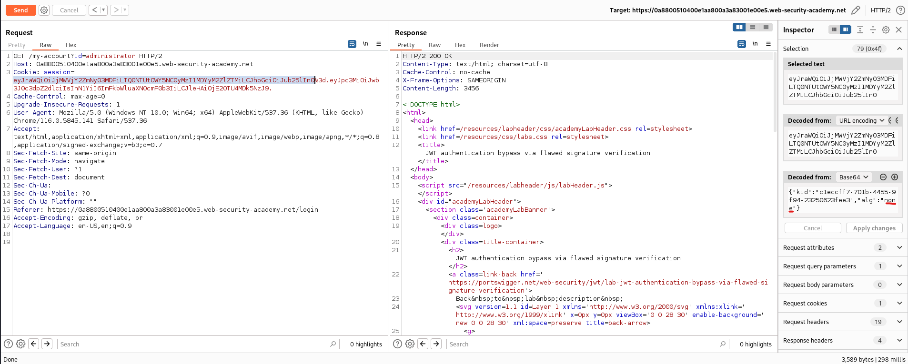
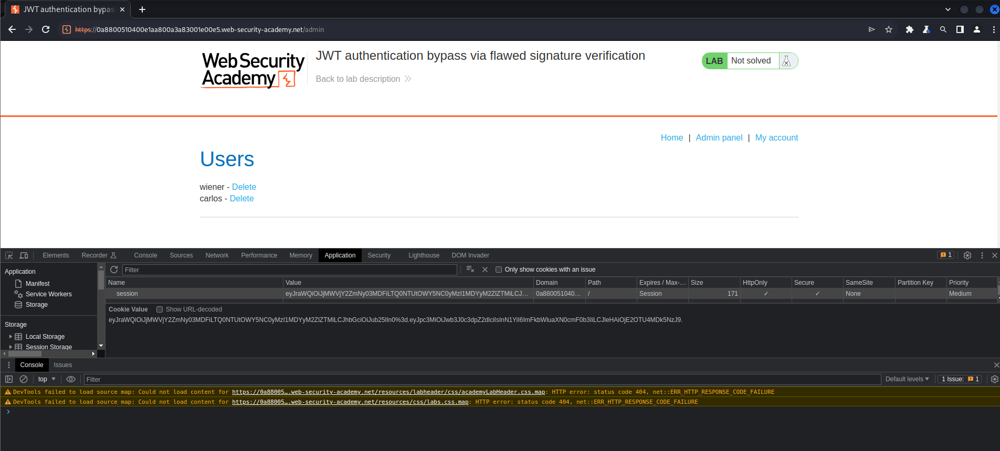

# Lab: JWT authentication bypass via flawed signature verification

# 1. Vulnerable

- Accepting tokens with no signature

Header của `JWT token`

```json
{
    "alg": "HS256",
    "typ": "JWT"
}
```

Tại phần header này, có thể thấy giá trị `"alg" = "HS256"` 

Đây là thuật toán `HMAC-SHA256` được sử dụng để tạo ra phần `signature` cho `tokens`

Nếu `alg` không sử dụng thuật toán nào , mặc định signature sẽ không có gì và ta có thể bypass được phần kiểm tra `tokens`

# 2. Exploit

Đầu tiên ta sẽ chuyển về

```json
{
    "kid":"c1eccff7-701b-4455-9f94-23250623fee3",
    "alg":"none"
}
```

Với giá trị `"alg"="none"` thì chương trình sẽ hiểu là ở đây không sử dụng thuật toán để tạo `signature` nên ta sẽ xóa phần `signature` ở session

-> khi ta đổi `payload` cũng như `header` sẽ không bị thay đổi `signature` (do không có)

-> bypass jwt check



Do lúc đầu ta đăng nhập bằng tài khoản của `wiener` nên việc còn lại là sửa session của trang web thành session vừa được sửa và xóa `carlos` -> solved

