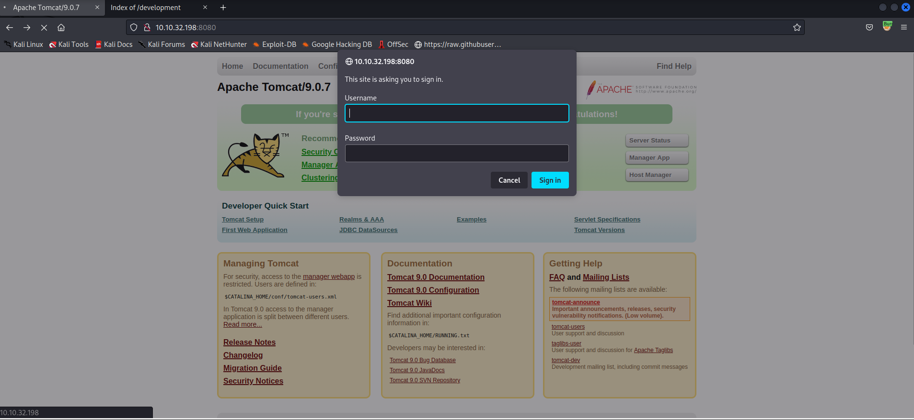

# Basic Pentesting

# 1. Find the services exposed by the machine

- Ta được cấp 1 địa chỉ IP

- Khi đã có 1 địa chỉ IP thì ta sẽ sử dụng nmap để quét các dịch vụ của IP này

```
└─$ nmap -T4 -sC -sV -p-10000 10.10.32.198 
Starting Nmap 7.93 ( https://nmap.org ) at 2023-09-19 07:55 EDT
Nmap scan report for 10.10.32.198
Host is up (0.21s latency).
Not shown: 9994 filtered tcp ports (no-response)
PORT     STATE SERVICE     VERSION
22/tcp   open  ssh         OpenSSH 7.2p2 Ubuntu 4ubuntu2.4 (Ubuntu Linux; protocol 2.0)
| ssh-hostkey: 
|   2048 db45cbbe4a8b71f8e93142aefff845e4 (RSA)
|   256 09b9b91ce0bf0e1c6f7ffe8e5f201bce (ECDSA)
|_  256 a5682b225f984a62213da2e2c5a9f7c2 (ED25519)
80/tcp   open  http        Apache httpd 2.4.18 ((Ubuntu))
|_http-server-header: Apache/2.4.18 (Ubuntu)
|_http-title: Site doesn't have a title (text/html).
139/tcp  open  netbios-ssn Samba smbd 3.X - 4.X (workgroup: WORKGROUP)
445/tcp  open  netbios-ssn Samba smbd 4.3.11-Ubuntu (workgroup: WORKGROUP)
8009/tcp open  ajp13       Apache Jserv (Protocol v1.3)
| ajp-methods: 
|_  Supported methods: GET HEAD POST OPTIONS
8080/tcp open  http        Apache Tomcat 9.0.7
|_http-title: Apache Tomcat/9.0.7
|_http-favicon: Apache Tomcat
Service Info: Host: BASIC2; OS: Linux; CPE: cpe:/o:linux:linux_kernel

Host script results:
|_clock-skew: mean: 1h20m02s, deviation: 2h18m34s, median: 1s
| smb-os-discovery: 
|   OS: Windows 6.1 (Samba 4.3.11-Ubuntu)
|   Computer name: basic2
|   NetBIOS computer name: BASIC2\x00
|   Domain name: \x00
|   FQDN: basic2
|_  System time: 2023-09-19T07:56:17-04:00
| smb2-time: 
|   date: 2023-09-19T11:56:17
|_  start_date: N/A
|_nbstat: NetBIOS name: BASIC2, NetBIOS user: <unknown>, NetBIOS MAC: 000000000000 (Xerox)
| smb-security-mode: 
|   account_used: guest
|   authentication_level: user
|   challenge_response: supported
|_  message_signing: disabled (dangerous, but default)
| smb2-security-mode: 
|   311: 
|_    Message signing enabled but not required

Service detection performed. Please report any incorrect results at https://nmap.org/submit/ .
Nmap done: 1 IP address (1 host up) scanned in 78.32 seconds
```

- -T4

Đây là 1 option để tùy chọn tốc độ quét của nmap (từ 0 - 5)

- -sC

Option này sẽ chạy `Script của Nmap` và giúp ta phát hiện các lỗ hổng bảo mật cũng như sai lệch trong khâu setup của máy chủ

- -sV

Option này sẽ giúp ta kiểm tra version của sever đang chạy

- -p-10000

Quét từ port 0-10000

Ở đây ta có các port đang mở sau:

```
PORT     STATE SERVICE     VERSION
22/tcp   open  ssh         OpenSSH 7.2p2 Ubuntu 4ubuntu2.4 (Ubuntu Linux; protocol 2.0)
80/tcp   open  http        Apache httpd 2.4.18 ((Ubuntu))
139/tcp  open  netbios-ssn Samba smbd 3.X - 4.X (workgroup: WORKGROUP)
445/tcp  open  netbios-ssn Samba smbd 4.3.11-Ubuntu (workgroup: WORKGROUP)
8009/tcp open  ajp13       Apache Jserv (Protocol v1.3)
8080/tcp open  http        Apache Tomcat 9.0.7
```

# 2. What is the name of the hidden directory on the web server(enter name without /)?

- Để tìm path ta sẽ sử dụng `dirsearch` hoặc `gobuster` để brute-force và nhận được `/development/`

# 3. User brute-forcing to find the username & password

Do ở port 80 không có gì liên quan đến tài khoản nên ta sẽ chuyển qua port 8080



Bắt `burpsuite` ta nhận được chuỗi theo dạng `base64encode(username:password)`

Gửi sang intruder để bắt đầu `brute-force` 
